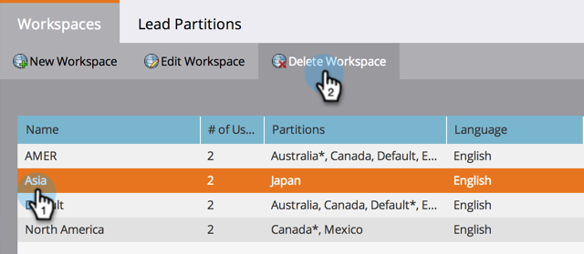

# Een werkruimte {#delete-a-workspace} verwijderen

>[!NOTE]
>
>**Beheerdersmachtigingen vereist**

>[!NOTE]
>
>U kunt de standaardwerkruimte in Marketo niet verwijderen.

1. Klik onder Beheer op **Werkruimten en partities**.

   

1. Selecteer een werkruimte en klik **Werkruimte verwijderen**.

   

   >[!NOTE]
   >
   >Vergeet niet dat **alle elementen in de werkruimte eerst moeten worden verwijderd**.

1. Klik **Verwijderen** om te bevestigen.

   
