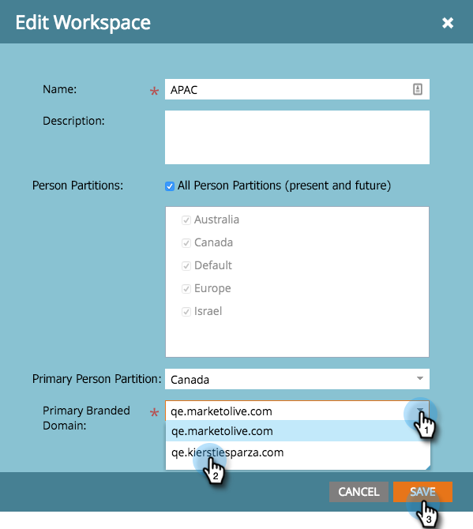

# Een werkruimte bewerken {#edit-a-workspace}

Soms moet u wijzigingen aanbrengen in een werkruimte. Het is gemakkelijk.

>[!NOTE]
>
>**Beheerdersmachtigingen vereist**

>[!NOTE]
>
>Penseel omhoog op werkruimten met [Werken- en personenpartities begrijpen](/help/marketo/product-docs/administration/workspaces-and-person-partitions/understanding-workspaces-and-person-partitions.md){target="_blank"}.

1. Ga naar de **[!UICONTROL Admin]** gebied.

   

1. Klik op **[!UICONTROL Workspaces & Partitions]**.

   

1. Selecteer de werkruimte die u wilt bewerken en klik op **[!UICONTROL Edit Workspace]**.

   

1. U kunt een verschillende hoofdpartitie selecteren en een andere primaire personenpartitie kiezen in de vervolgkeuzelijst.

   >[!NOTE]
   >
   >U kunt [meer persoonlijke partities maken](/help/marketo/product-docs/administration/workspaces-and-person-partitions/create-a-person-partition.md){target="_blank"} als u ze nodig hebt.

   

   >[!NOTE]
   >
   >De **[!UICONTROL All Person Partitions]** selectievakje betekent dat in deze werkruimte alle leadpartities in het systeem kunnen worden gebruikt.

   >[!NOTE]
   >
   >De **[!UICONTROL Primary Person Partition]** fungeert als de standaardinstelling en is waar alle personen worden toegewezen.

   Als u meerdere domeinen met branding hebt ingeschakeld, kunt u overschakelen op een ander domein met primaire branding. Klik op **[!UICONTROL Save]**.

   

   >[!NOTE]
   >
   >U kunt de werkruimtetaal niet wijzigen.

>[!MORELIKETHIS]
>
>* [Een nieuwe werkruimte maken](/help/marketo/product-docs/administration/workspaces-and-person-partitions/create-a-new-workspace.md){target="_blank"}
>* [Werken- en personenpartities begrijpen](/help/marketo/product-docs/administration/workspaces-and-person-partitions/understanding-workspaces-and-person-partitions.md){target="_blank"}
