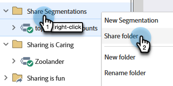

# Segmenten delen over werkruimten en partities {#share-segmentations-across-workspaces-and-partitions}

>[!PREREQUISITES]
>
>Dit artikel is alleen bedoeld voor klanten met werkruimten en partities.

## Wat is een segmentatie? {#whats-a-segmentation}

Marketo is geweldig in het uitkiezen van de juiste mensen voor een programma of slimme campagne. Voor meer permanente personen moet u echter segmentaties gebruiken. Ze zijn nodig om geavanceerde dynamische inhoud in Marketo te gebruiken.

>[!NOTE]
>
>Leer [&#x200B; hoe te om segmentaties &#x200B;](/help/marketo/product-docs/personalization/segmentation-and-snippets/segmentation/create-a-segmentation.md) tot stand te brengen.

Zodra u deze persoonlijkopstelling hebt (_en_ u werkruimten gebruikt), zult u hen over uw werkruimten willen delen. Hier zijn een paar goede dingen om te weten:

## Regels en tips {#rules-tips}

* Elk Marketo abonnement kan tot 20 Segmentaties &quot;totaal&quot;over veelvoudige werkruimten bevatten (**niet 20 per werkruimte**).
* U kunt een Segmentatie met werkruimten slechts delen die u toegang tot hebt.
* Zorg ervoor om a **Standaardwerkruimte tot stand te brengen en te gebruiken die zicht in alle verdelingen** heeft.

* De verwerking van de segmentatie loopt slechts op de mensen in de werkruimte waar de Segmentatie wordt gecreeerd.

   * Maak de segmentatie die u wilt delen in de standaard-Workspace.
      * De segmentatie goedkeuren
      * De gedeelde werkruimte ziet een vergrendelde map en de segmentatie is alleen-lezen.
      * De gedeelde versie kan niet worden bewerkt. U kunt de oorspronkelijke segmentatie alleen bewerken op de plaats waar deze is gemaakt.

   * Wanneer u op een Segment (b.v. Gezondheidszorg) binnen een gedeelde Segmentatie klikt, zullen de mensen u ziet slechts mensen in de verdeling verbonden aan de werkruimte zijn u bekijkt.
      * Als u een Segmentatie in Workspace 1 (WS1) creeert en het met WS2 deelt en WS1 heeft geen toegang tot de verdeling voor WS2, ZAL het NIET de Segmentatie opnieuw berekenen.
      * Als u een Segmentatie in een werkruimte creeert die verdelingen heeft, en het dan met een andere werkruimte deelt, zal die werkruimte die de gedeelde Segmentatie ontving slechts mensen zien als zij overlappen hebben.

>[!NOTE]
>
>Sommige van deze regels zijn een beetje ingewikkeld. De eenvoudigste manier om aan de slag te gaan is met specifieke mensen te testen. Je kunt altijd nieuwe segmentaties maken en oude weghalen.

## Voorbeeldscenario&#39;s {#example-scenarios}

## Een segmentatie delen {#share-a-segmentation}

1. Ga naar de **[!UICONTROL Database]** .

   

1. Klik met de rechtermuisknop **[!UICONTROL Segmentations]** en selecteer **[!UICONTROL New Folder]** .

   

1. Geef een naam op voor de map die u wilt delen in de verschillende werkruimten (bijvoorbeeld Segmenten delen) en klik op **[!UICONTROL Create]** .

   

1. Verplaats de segmentatie(s) die u wilt delen naar de map.

   

1. Klik met de rechtermuisknop op de map en selecteer **[!UICONTROL Share Folder]** .

   

1. Selecteer de werkruimte(n) waarmee u de map wilt delen. Klik op **[!UICONTROL Save]**.

   

   >[!NOTE]
   >
   >In het dialoogvenster worden de werkruimten weergegeven die u kunt weergeven. Daarom wordt u aangeraden om in de werkruimte Standaard segmentaties te maken en te delen die zichtbaar zijn in alle werkruimten en partities.

De voortkomende omslag toont in de boom van het Gegevensbestand met een pijl erop wijst die dat het met andere werkruimten wordt gedeeld. Vanuit de gedeelde werkruimte wordt in de map een vergrendeling weergegeven om aan te geven dat de inhoud van de map is gedeeld vanuit een andere werkruimte en alleen-lezen is.
