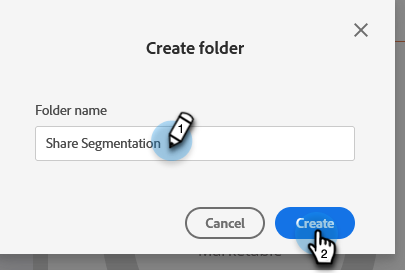

# Werken- en personenpartities begrijpen {#understanding-workspaces-and-person-partitions}

## Werkruimten {#workspaces}

>[!CAUTION]
>
>Werkruimten kunnen complex zijn om in te stellen. Contact [Marketo-ondersteuning](https://nation.marketo.com/t5/Support/ct-p/Support) om te weten te komen of ze voor je geschikt zijn.

De werkruimten zijn afzonderlijke gebieden in Marketo die marketingmiddelen zoals programma&#39;s, landingspagina&#39;s, e-mails en meer bevatten. Ze kunnen door meerdere mensen worden gebruikt. Elke gebruiker heeft toegang tot een of meer werkruimten.

>[!NOTE]
>
>**Voorbeeld**
>
>Een aantal redenen waarom u een werkruimte kunt gebruiken:
>
>* Geografie: de marketingafdelingen in Europa, Azië en Noord-Amerika krijgen elk een werkruimte
>* Bedrijfseenheid: [!DNL Quicken], [!DNL Quickbooks] en [!DNL TurboTax] elk krijgt een werkruimte
>
>In elk geval is de scheiding omdat de marketingactiva totaal verschillend zijn. Als zij marketing activa delen, dan kunnen de werkruimten niet het juiste hulpmiddel voor u zijn.

>[!NOTE]
>
>Leer hoe u creeert [een nieuwe werkruimte maken](/help/marketo/product-docs/administration/workspaces-and-person-partitions/create-a-new-workspace.md).

## Delen over werkruimten {#sharing-across-workspaces}

Hieronder wordt beschreven hoe u elementen deelt over verschillende werkruimten. Het werkt hetzelfde voor alles wat u wilt delen. In dit voorbeeld ziet u segmentaties.

>[!NOTE]
>
>De bovenliggende map met uw elementen is de enige map die kan worden gedeeld, niet de onderliggende mappen.

1. Klik op **[!UICONTROL Database]**.

   

1. Klik met de rechtermuisknop op de map Segmentatie en klik op **[!UICONTROL New Folder]**.

   

1. Geef uw map een naam en klik op **[!UICONTROL Create]**.

   

1. Verplaats de middelen die u wilt delen naar de map.

   

1. Klik met de rechtermuisknop op de map en selecteer **[!UICONTROL Share Folder]**.

   

1. Selecteer de werkruimte(n) waarmee u de map wilt delen en klik op **[!UICONTROL Save]**. In het dialoogvenster Map delen worden alleen werkruimten weergegeven die u kunt weergeven.

   

   >[!NOTE]
   >
   >De oorspronkelijke map bevat nu een kleine groene pijl die aangeeft dat deze is gedeeld. In de gedeelde werkruimte heeft de map een hangslot die alleen-lezen aangeeft.

U kunt deze items delen in verschillende werkruimten.

* E-mailsjablonen
* Sjablonen voor bestemmingspagina
* Modellen
* Slimme campagnes
* [Slimme lijsten](/help/marketo/product-docs/core-marketo-concepts/smart-lists-and-static-lists/using-smart-lists/reference-a-list-or-smart-list-across-workspaces.md)
* [Segmentaties](/help/marketo/product-docs/administration/workspaces-and-person-partitions/share-segmentations-across-workspaces-and-partitions.md)
* Fragmenten

## Klonen in verschillende werkruimten {#cloning-across-workspaces}

Voor activa die geen malplaatjes zijn, is het best om hen als lokale activa binnen van een programma te klonen. Met het juiste toegangsniveau kunt u deze elementen naar een andere werkruimte slepen:

* Programma&#39;s
* E-mails
* Landingspagina&#39;s
* Forms

>[!IMPORTANT]
>
>Alle hierboven vermelde items kunnen worden gekloond op werkruimten, e-mails, formulieren en bestemmingspagina&#39;s _moet zich binnen een programma bevinden_ op het moment van het klonen.

>[!NOTE]
>
>Wanneer het klonen van activa die malplaatjes hebben, moeten die malplaatjes met de bestemmingswerkruimte worden gedeeld.

## Elementen verplaatsen naar andere werkruimten {#moving-assets-to-other-workspaces}

Als u elementen naar een nieuwe werkruimte wilt verplaatsen, plaatst u ze in een map en sleept u de map over naar de andere werkruimte.

>[!NOTE]
>
>U kunt een programma dat leden van één werkruimte aan een andere bevat niet bewegen.

## Personpartities {#person-partitions}

Personverdelingen fungeren als aparte databases. Elke verdeling heeft zijn eigen mensen die niet ontdupe of mengen met andere verdelingen. Als je een kwestie hebt voor zakelijk gebruik waarvoor dubbele records met hetzelfde e-mailadres nodig kunnen zijn, neem dan contact op met [Marketo-ondersteuning](https://nation.marketo.com/t5/Support/ct-p/Support).

U kunt partities toewijzen aan personen  [werkruimten](create-a-new-workspace.md) in de volgende configuraties:

* Eén werkruimte naar één partitie met personen (1:1)
* Eén werkruimte voor partities van vele personen (1:x)
* vele werkruimten aan één persoonverdeling (x:1)

>[!NOTE]
>
>Redenen waarop u een partitie voor personen wilt gebruiken:
>
>* Uw werkruimten hebben niet alleen verschillende middelen, maar delen ook geen personen
>* U wilt duplicaten om andere zakelijke redenen

>[!CAUTION]
>
>De verdelingen van de persoon werken niet met elkaar in wisselwerking, zodat ben zorgvuldig wanneer het vestigen van hen.

>[!NOTE]
>
>Leer hoe u [een partitie voor personen maken](/help/marketo/product-docs/administration/workspaces-and-person-partitions/create-a-person-partition.md).
