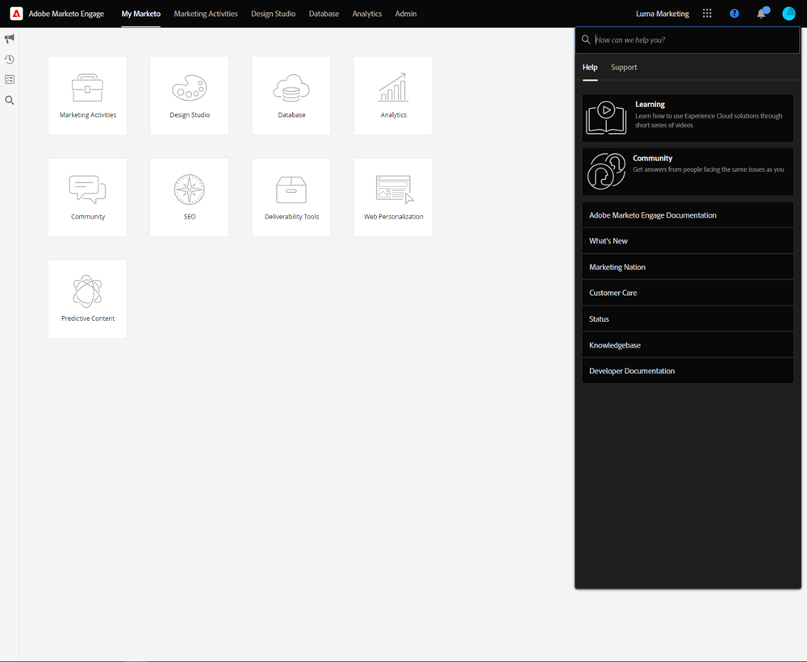

# Overzicht Adobe Experience Cloud Interface {#adobe-experience-cloud-interface-overview}

Met Adobe Experience Cloud Interface wordt de &#39;shell&#39;-look en -feel van Adobe Experience Cloud-toepassingen en -services uitgelijnd. Maar het is meer dan alleen een nieuw ontwerp. Het is een toepassing van één pagina die gebruikerservaring in één enkele instantie levert.

## Gebruikersstroom {#user-flow}

Als u niet reeds aan een product van Adobe Experience Cloud wordt het programma geopend, login direct aan [!DNL Marketo Engage] hier: [ https://experience.adobe.com/marketo-engage ](https://experience.adobe.com/marketo-engage).

Als u __ reeds het programma wordt geopend aan een product van Adobe Experience Cloud, klik eenvoudig het menupictogram en selecteer **[!DNL Marketo Engage]**.

>[!NOTE]
>
>Het vervolgkeuzemenu ziet er mogelijk anders uit, afhankelijk van de Adobe Experience Cloud-producten waarop u zich hebt geabonneerd.

## Nieuwe functies {#new-features}

Naast de bijgewerkte look en feel zult u de volgende functies opmerken:

**Geïntegreerd Centrum van de Hulp**

U kunt vanuit de [!DNL Marketo Engage] -toepassing toegang krijgen tot diverse beschikbare Help-bronnen.

**Schakelaar van de Toepassing**

Diegenen die toegang hebben tot meerdere Adobe-producten kunnen gemakkelijk van elkaar wisselen.

**Meldingen en Mededelingen**

Bekijk en communiceer rechtstreeks met productspecifieke meldingen en algemene Adobe-productaankondigingen in de toepassing.

**de Montages van Adobe**

Klik op het profielpictogram om de taal of andere voorkeuren voor Adobe te wijzigen.

## Veelgestelde vragen {#faq}

**ik kan niet login aan [!DNL Marketo Engage] door de Interface van Experience Cloud. Wat zou de kwestie kunnen zijn?**

Als u zich kunt aanmelden bij Adobe Experience Cloud maar de fout &#39;&#39;Kan pagina niet laden&#39;&#39; ziet, kan het probleem zich voordoen op de zijde van [!DNL Marketo Engage] . Gelieve te contacteren {de Steun van 0} Marketo [ voor hulp.](https://nation.marketo.com/t5/support/ct-p/Support)

**waar ging de Geschiedenis van de Gebruiker, Globaal Onderzoek, de Meldingen van Marketo, en het dienblad?**

Deze functies zijn verplaatst van de bovenste nav naar een nieuwe balk links in de Experience Cloud Interface.

