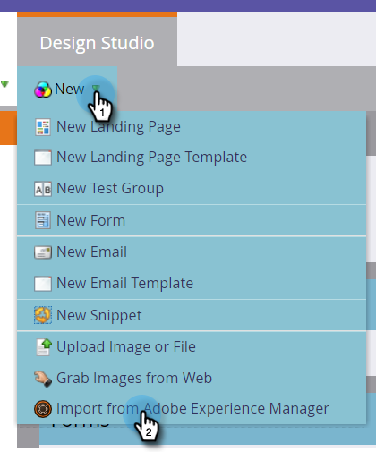
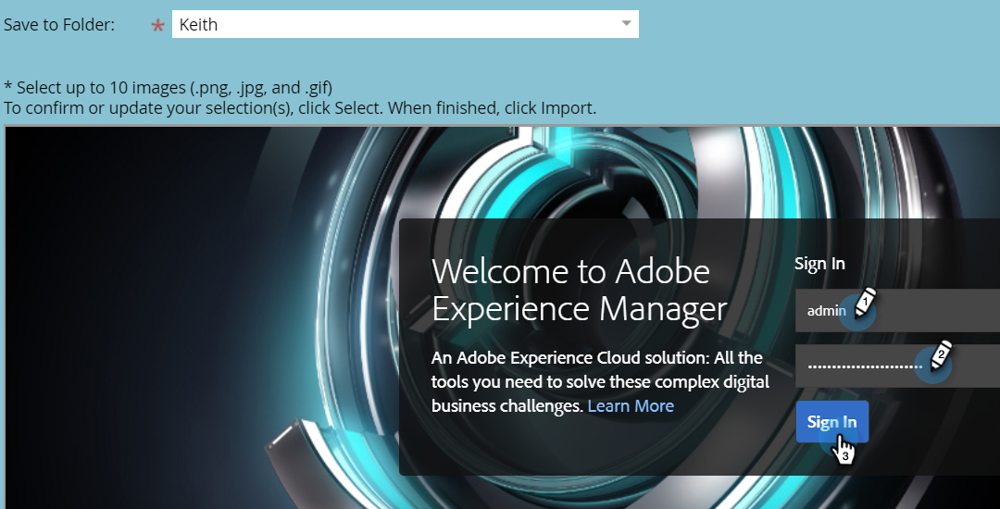
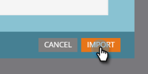

# Middelen importeren met Adobe Experience Manager {#importing-assets-with-adobe-experience-manager}

Met de Asset Selector kunnen Marketo-klanten AEM middelen openen, selecteren en importeren in de Marketo [!DNL Design Studio]. **Beheerdersmachtigingen zijn vereist**.

>[!AVAILABILITY]
>
>Niet iedereen heeft deze functie aangeschaft. Neem contact op met het accountteam van Adobe (uw accountmanager) voor meer informatie.

>[!PREREQUISITES]
>
>Zorg ervoor dat u de opdracht [AEM](/help/marketo/product-docs/core-marketo-concepts/miscellaneous/configuring-adobe-experience-manager-integration.md).

>[!IMPORTANT]
>
>Deze functie wordt momenteel alleen volledig ondersteund in [!DNL Firefox]. Het wordt niet ondersteund in [!DNL Safari]en werkt het mogelijk niet in de meest recente versie van [!DNL Chrome], afhankelijk van uw [!DNL SameSite] cookie-instellingen.

1. Klik op **[!UICONTROL Design Studio]**.

   

1. Klik op de vervolgkeuzelijst Nieuw en selecteer **[!UICONTROL Import from Adobe Experience Manager]**.

   

1. Kies de map waarin uw afbeeldingen worden opgeslagen.

   

1. Meld u aan bij Adobe Experience Manager (als u dat nog niet hebt gedaan).

   

1. Kies uw map. Selecteer vervolgens de gewenste afbeeldingen door op de miniatuur te klikken (u kunt maximaal 10 afbeeldingen selecteren). Klikken **[!UICONTROL Select]** wanneer gereed.

   

   >[!NOTE]
   >
   >Afbeeldingen mogen niet groter zijn dan 100 MB.

1. Klikken **[!UICONTROL Import]** om het proces te voltooien.

   

   En dat is het! Klikken **[!UICONTROL Close]** om aan de Studio van het Ontwerp terug te keren.

   

## Notities {#things-to-note}

* Marketo biedt momenteel ondersteuning voor Adobe Experience Manager versie 6.4 en 6.5.

* Alle gebruikers in uw exemplaar zullen de beelden kunnen bekijken/toegang hebben u invoert.

* Afbeeldingen worden niet automatisch bijgewerkt. Als u een afbeelding naar de Marketo hebt geïmporteerd [!DNL Design Studio] wordt bijgewerkt in AEM, moet u het handmatig opnieuw importeren in Marketo.
