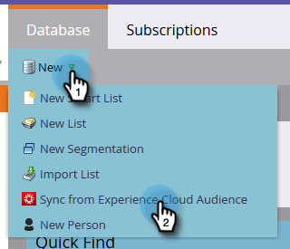

# Een publiek synchroniseren vanuit Adobe Experience Cloud {#sync-an-audience-from-adobe-experience-cloud}

>[!NOTE]
>
>Een implementatie van een Marketo-instantie die klaar is voor HIPAA, kan deze integratie niet gebruiken.

>[!PREREQUISITES]
>
>[ de Plaatsing van de Organisatie van Adobe van de Opstelling Afbeelding ](/help/marketo/product-docs/adobe-experience-cloud-integrations/set-up-adobe-organization-mapping.md){target="_blank"}

## Een publiek synchroniseren {#how-to-sync-an-audience}

1. Klik in Mijn Marketo op de tegel **[!UICONTROL Database]** .

   

1. Klik op de vervolgkeuzelijst **[!UICONTROL New]** en selecteer **[!UICONTROL Sync from Experience Cloud Audience]** .

   

1. Klik op de vervolgkeuzelijst **[!UICONTROL Audience Library Folder]** en selecteer de gewenste oorspronkelijke map.

   

1. Selecteer een **[!UICONTROL Audience Name]** .

   

1. Voor de bestemming, kunt u een bestaande lijst selecteren, of de naam van nieuwe typen. In dit voorbeeld maken we een nieuwe. Klik op **[!UICONTROL Sync]** als u klaar bent.

   

1. Klik op **[!UICONTROL OK]**.

   

## Veelgestelde vragen {#faq}

**hoe werkt de koekjessynchronisatie?**

Wanneer de cookiesync voor uw Marketo Abonnement wordt toegelaten, probeert Marketo munchkin.js om Adobe ECIDs voor de Org van de IMS van Adobe te vangen en op te slaan u tijdens de integratieopstelling specificeerde en deze ECIDs aan het overeenkomstige koekjesherkenningsteken van Marketo aan te passen. Hierdoor kunnen anonieme gebruikersprofielen van Marketo worden verrijkt met Adobe ECID&#39;s.

Een volgende stap is vereist om het anonieme gebruikersprofiel te koppelen aan een lead-profiel, dat wordt geïdentificeerd met een e-mailbericht met normale tekst. Precies hoe dit werk [ hier ](/help/marketo/product-docs/reporting/basic-reporting/report-activity/tracking-anonymous-activity-and-people.md){target="_blank"} wordt beschreven.

**waarom is de lijstgrootte in Marketo verschillend dan in Adobe?**

Een persoon synchroniseert ook niet als we een ECID-cookie-id niet aan een bekende persoon in Marketo kunnen koppelen.

**is dit een eenmalige synchronisatie?**

U hoeft de synchronisatie slechts eenmaal te starten. Daarna worden records automatisch gesynchroniseerd. De eerste synchronisatie kan tot 24 uur duren; in de toekomst wordt de synchronisatie van nieuwe records binnen 2-3 uur uitgevoerd.
