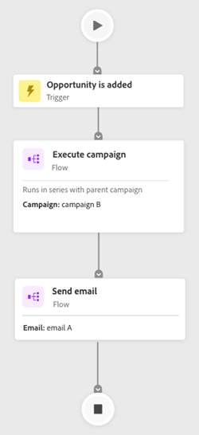
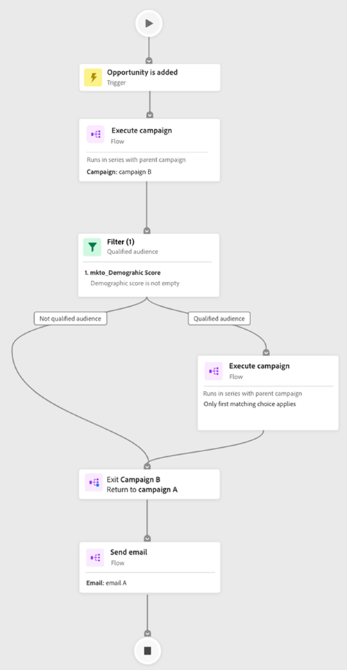
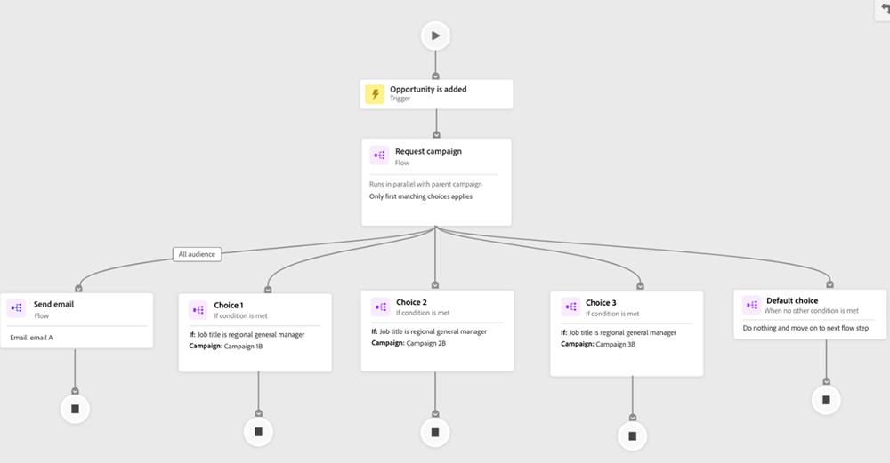

# Tabblad Betrokkenheid {#engagement-map-tab}

De Kaart van de betrokkenheid wordt vertegenwoordigd door een reeks trekker, filter, en debietkaarten. Als u op elke kaart klikt, wordt aanvullende informatie weergegeven.

Overzicht van trigger: Deze kaart geeft het aantal triggers in uw campagne weer. Als u erop klikt, wordt voor elke trigger een kaart weergegeven, plus een uitschuifvenster met de volgende informatie:

* Campagne voeren waarbij de trigger hoort
* Lijst met triggernamen
* Trigger bewerken

  

Triggergegevens: op deze kaart wordt de naam van de trigger weergegeven. Als u erop klikt, wordt er een deelvenster weergegeven met de volgende gegevens:

* Campagne voeren waarbij de trigger hoort
* Lijst met beperkingen die zijn gekoppeld aan de trigger
* Trigger bewerken

Filter: als u op deze kaart klikt, verschijnt er een venster met de volgende informatie over uitschuivingen:

* Campagne van het filter behoort tot
* Geschat aantal personen dat voor het filter in aanmerking komt
* Lijst van filters en hun respectieve beperkingen
* Filter bewerken

  

Stappen van de stroom: Als een Stap van de Stroom keuzen omvat, toont deze kaart de naam van de Stap van de Stroom. Als u erop klikt, wordt er een deelvenster weergegeven met de volgende gegevens:

* Campagne de Stroom Stap behoort tot
* Lijst met keuzevoorwaarden die zijn gekoppeld aan de stroomstap
* Stroom bewerken

Stappen van de stroom: Als een Stap van de Stroom __ geen keuzen omvat, toont deze kaart de attributen verbonden aan de Stap van de Stroom. Als u erop klikt, wordt er een deelvenster weergegeven met de volgende gegevens:

* Campagne de Stroom Stap behoort tot
* Lijst met kenmerken die zijn gekoppeld aan de Flow Step
* Stroom bewerken

  

## De Stap van de stroom voor Uitvoeren en vraagt Campagnes {#flow-step-for-execute-and-request-campaigns}

* Als de Stap van de Stroom van de Campagne van het Uitvoeren of van het Verzoek om geen keuzen omvat, toont de kaart de naam van de campagne. Als u op de kaart klikt, verschijnt er een venster met de volgende informatie over uitschuivingen:

   * Campagne de Stroom Stap behoort tot
   * Stroom bewerken
   * Lijst met kenmerken die zijn gekoppeld aan de Flow Step
   * De knop Lijst weergeven, waarmee u een lijst opent met campagnes die de specifieke campagne Verzoek/Uitvoeren gebruiken

>[!NOTE]
>
>U kunt de Stroom Stap(s) van een primaire campagne bewerken. Als u geneste campagnes wilt bewerken, navigeert u naar de campagne via de koppeling in het deelvenster Uitschuiven.

* Als de Stap van de Stroom van de Campagne van de Uitvoeren of van het Verzoek van de Steek keuzen omvat, zal het klikken op de kaart een diapaneel met de volgende informatie openbaren:

   * Campagne de Stroom Stap behoort tot
   * Lijst met keuzevoorwaarden die zijn gekoppeld aan de stroomstap
   * Stroom bewerken

* Als een campagne voor uitvoeren of aanvragen opties bevat, wordt het klikken op de stroomkaart uitgebreid en worden alle opties in de afzonderlijke kaarten weergegeven. Het klikken op de _keus_ kaart breidt de campagne verbonden aan de specifieke keus uit evenals openbaart een dia-uit paneel met de volgende informatie:

   * Campagne van de keuze behoort tot
   * Keuze bewerken
   * Lijst met keuzevoorwaarden die zijn gekoppeld aan de stroomstap
   * De lijst van de mening, die een lijst van campagnes opent die de specifieke Campagne van het Verzoek/van de Uitvoer gebruiken

  

## Een geneste campagne voor uitvoeren visualiseren {#visualizing-a-nested-execute-campaign}

Voer campagnes in serie met de oudercampagne uit. De mensen die voor een uitvoerbare campagne kwalificeren voltooien alle Stappen van de Stroom van de campagne en keren aan de primaire campagne terug om door de Stappen van de Stroom van deze campagne verder te gaan.

Hieronder ziet u een voorbeeld van een slimme campagne, ‘Campagne A’, die een uitvoeringsstroomstap voor de campagne omvat. Beschouw &#39;Campagne A&#39; als uw primaire campagne.

1. Klik op de uitvoerkaart voor de campagnestroom om de details van &quot;Campagne B&quot; weer te geven.
1. &quot;Campagne B&quot; omvat een filter dat het publiek in twee groepen splitst: gekwalificeerd en niet gekwalificeerd.
1. Een gekwalificeerd publiek doorloopt de stappen van de Stroom verbonden aan &quot;Campagne B.&quot;
1. Alle (gekwalificeerde en niet-gekwalificeerde) doelgroepen keren terug naar ‘Campagne A’ en gaan verder naar de volgende Flow Step.

   

U kunt op de Uitvoeren Stap van de Stroom van de Campagne in &quot;Campagne B&quot;klikken die zich zal uitbreiden om de keuzevaarten en de campagne te tonen verbonden aan elke keus.

## Bezig met visualiseren aanvraagcampagne {#visualizing-request-campaign}

Aanvraagcampagnes worden parallel met de bovenliggende campagne uitgevoerd. Personen die in aanmerking komen voor een aanvraagcampagne, voltooien alle Stappen van de Stroom van de campagne en sluiten de campagne vervolgens af. Tegelijk, gaat de zelfde reeks mensen door de Stappen van de Stroom van de primaire campagne.

Hier is een voorbeeld van een Slimme Campagne, &quot;Campagne A,&quot;die een Stap van de de Stroom van de verzoekcampagne omvat. Beschouw &#39;Campagne A&#39; als uw primaire campagne.

1. Klik op de de stroomkaart van de verzoekcampagne breidt zich uit om de details van &quot;Campagne B&quot; te tonen
1. &quot;Campagne B&quot; omvat een filter dat het publiek in twee groepen splitst: gekwalificeerd en niet gekwalificeerd.
1. Gekwalificeerd publiek doorloopt de stappen van de Stroom verbonden aan &quot;Campagne B.&quot;
1. Tezelfdertijd beweegt alle publiek zich aan de volgende Stappen van de Stroom in &quot;Campagne A.&quot;

   

U kunt dieper in uw genestelde campagnes duiken als om het even welke Stappen van de Stroom een andere verzoekcampagne door op de stroomkaart te klikken om de details van de campagne te bekijken omvatten.

Hier is een voorbeeld van een aanvraagcampagne met keuzes.

## Foutafhandeling {#error-handling}

Fouten in slimme lijsten en stroomstappen worden gemarkeerd met een rood pictogram op de kaart. Bovendien wordt een bijbehorende foutmelding weergegeven in het deelvenster Uitschuiven.

De waarschuwingen in Slimme Lijsten en de Stappen van de Stroom worden benadrukt via een oranje pictogram in de kaart. Bovendien wordt een bijbehorend waarschuwingsbericht weergegeven in het deelvenster Uitschuiven.

Hieronder ziet u een voorbeeld van een waarschuwing in een Keuzenkaart die u kunt zien in de Stapkaart voor de uitloop van campagne uitvoeren, het deelvenster Uitschuiven en de Standaard-keuzevenkaart.

>[!NOTE]
>
>Waarschuwingen zijn aanbevelingen om te controleren, maar ze zijn niet indicatief voor fouten in de slimme campagne.

**de Fouten in filterkaarten kunnen omvatten:**

* Een fout in de slimme lijst die ertoe zal leiden dat een gekwalificeerd publiek niet wordt getoond

* Een fout in de filterlogica

* Een fout in beperkingen (of het ontbreken daarvan) in een of meer filters

  

>[!NOTE]
>
>Fouten in een geneste campagne zijn pas zichtbaar nadat u hebt geklikt om de geneste campagne uit te breiden.
