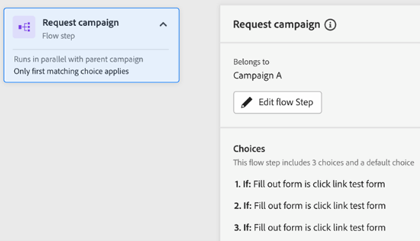

# Tabblad Betrokkenheid {#engagement-map-tab}

De Kaart van de betrokkenheid wordt vertegenwoordigd door een reeks trekker, filter, en debietkaarten. Als u op elke kaart klikt, worden aanvullende gegevens weergegeven.

Overzicht van trigger: Deze kaart toont het aantal triggers in uw campagne. Als u erop klikt, wordt een kaart voor elke trigger en een uitschuifvenster weergegeven met de volgende informatie:

* Campagne voeren waarbij de trigger hoort
* Lijst met triggernamen
* Knop Trigger bewerken

  

Detail trigger: Op deze kaart wordt de triggernaam weergegeven. Als u erop klikt, wordt een uitschuifvenster weergegeven met de volgende informatie:

* Campagne voeren waarbij de trigger hoort
* Lijst met beperkingen die zijn gekoppeld aan de trigger
* Knop Trigger bewerken

  

Filter: Als u op deze kaart klikt, wordt een venster met de volgende gegevens weergegeven:

* Campagne voeren waarbij de trigger hoort
* Geschat aantal personen dat voor het filter in aanmerking komt
* Lijst van filters en hun respectieve beperkingen
* De knop Filter bewerken

  

Stappen voor stroom: Als een flowstap keuzen bevat, wordt op deze kaart de naam van de flowstap weergegeven. Als u erop klikt, wordt een uitschuifvenster weergegeven met de volgende informatie:

* Campagne voeren voor de stap Stroom behoort tot
* Lijst met keuzevoorwaarden die aan de flowstap zijn gekoppeld
* De knop Stroom bewerken

  

Stappen voor stroom: Als een stroomstap _niet_ Deze kaart bevat alle opties die aan de flowstap zijn gekoppeld. Als u erop klikt, wordt een uitschuifvenster weergegeven met de volgende informatie:

* Campagne voeren voor de stap Stroom behoort tot
* Lijst met kenmerken die aan de flowstap zijn gekoppeld
* De knop Stroom bewerken

  

## De Stap van de stroom voor Uitvoeren en vraagt Campagnes {#flow-step-for-execute-and-request-campaigns}

* Als de de stroomstap van de Campagne van de Uitvoeren of van het Verzoek geen keuzen omvat, zal de kaart de naam van de campagne tonen. Als u op de kaart klikt, wordt een venster met de volgende informatie weergegeven:

   * Campagne voeren voor de flowstap behoort tot
   * De knop Stroom bewerken
   * Lijst met kenmerken die aan de flowstap zijn gekoppeld
   * De knop Lijst weergeven, waarmee u een lijst opent met campagnes die de specifieke campagne Verzoek/Uitvoeren gebruiken

>[!NOTE]
>
>U kunt de flowstap(en) vanuit een primaire campagne bewerken. Als u geneste campagnes wilt bewerken, moet u naar de campagne navigeren via de koppeling in het deelvenster Uitschuiven.

* Als de de stroomstap van de Campagne van de Uitvoeren of van het Verzoek keuzen omvat, zal de kaart de naam van de campagne tonen. Als u op de kaart klikt, wordt een venster met de volgende informatie weergegeven:

   * Campagne voeren voor de flowstap behoort tot
   * Lijst met keuzevoorwaarden die aan de flowstap zijn gekoppeld
   * De knop Stroom bewerken

  

  

* Als een campagne voor uitvoeren of aanvragen opties bevat, wordt het klikken op de stroomkaart uitgebreid en worden alle opties in de afzonderlijke kaarten weergegeven. Als u op de keuzevaart klikt, wordt de campagne voor de specifieke keuze uitgebreid en wordt een venster met de volgende informatie weergegeven:

   * Campagne van de keuze behoort tot
   * Knop Keuze bewerken
   * Lijst met keuzevoorwaarden die aan de flowstap zijn gekoppeld
   * De knop Lijst weergeven, waarmee u een lijst opent met campagnes die de specifieke campagne Verzoek/Uitvoeren gebruiken

  

## Een geneste campagne voor uitvoeren visualiseren {#visualizing-a-nested-execute-campaign}

HIER BEVESTIGD BEWERKEN—

Voer campagnes in serie met de ouder campagne-mensen uit die voor een uitvoerbare campagne kwalificeren alle stroomstappen van de campagne voltooien en aan de primaire campagne terugkeren om door de stroomstappen van deze campagne te blijven.

Hieronder ziet u een voorbeeld van een slimme campagne, Campagne A, die een stap bevat voor het uitvoeren van de campagnestroom. Beschouw &#39;Campagne A&#39; als uw primaire campagne.

1. Klik op de campagnestrookaart voor uitvoeren om de details van &quot;Campagne B&quot; weer te geven.
1. &quot;Campagne B&quot; omvat een filter dat zich vertakken naar gekwalificeerd en niet gekwalificeerd publiek.
1. Gekwalificeerd publiek doorloopt stroomstappen gekoppeld aan ‘Campagne B.’
1. Alle (gekwalificeerde en niet-gekwalificeerde) doelgroepen keren terug naar &quot;Campagne A&quot; en gaan door naar de volgende flowstap.

HIER GESTOPT BEWERKEN—

U kunt op de Uitvoeren de stroomstap van de Campagne in &quot;Campagne B&quot;klikken die zal uitbreiden om keuzevakaarten en campagne te tonen verbonden aan elke keus.

## Bezig met visualiseren aanvraagcampagne {#visualizing-request-campaign}

Aanvraagcampagnes lopen parallel aan de bovenliggende campagne, d.w.z. leads die in aanmerking komen voor een aanvraagcampagne, voltooien alle stappen van de campagne en sluiten de campagne af. Parallel daaraan zal dezelfde reeks leads ook doorlopen vanaf de primaire campagne

Hier is een voorbeeld van een slimme campagne &quot;Campagne A&quot;die een stap van de verzoekcampagnestroom omvat. Je kunt &#39;Campagne A&#39; zien als je primaire campagne.

1. Klik op de de stroomkaart van de verzoekcampagne zal uitbreiden om details van &quot;Campagne B&quot; te tonen
1. Campagne B bevat een filter dat zich vertakt naar een gekwalificeerd publiek.
1. Gekwalificeerd publiek doorloopt stroomstappen gekoppeld aan ‘Campagne B’
1. Tegelijkertijd verplaatst alle doelgroepen zich naar de volgende flowstappen in ‘Campagne A’

   

U kunt dieper in geneste campagnes duiken, als om het even welke stroomstappen nog een verzoekcampagne door op de stroomkaart te klikken om details van de campagne te bekijken omvat

Hier is een voorbeeld van aanvraagcampagne met keuzes.

## Foutafhandeling {#error-handling}

Fouten in slimme lijst- en stroomstappen worden gemarkeerd met een foutpictogram op de kaart. Bovendien wordt het bijbehorende foutbericht weergegeven in het deelvenster Uitschuiven.

Hier is een voorbeeld van fout in trekker die in de kaart van het trekkeroverzicht, dia uit paneel evenals detailtrekkerkaart zal worden vermeld

Fout in filterkaart kan

Fout in slimme lijst die ertoe zal leiden dat gekwalificeerd publiek niet wordt getoond

Fout in filterlogica

Fout in beperkingen of ontbreken daarvan in een of meer filters

Als u geen waarden (kenmerken) invoert, worden deze niet als fouten gemarkeerd, maar werken deze wel zoals op het tabblad Stroom. Bestaande campagnes zullen daarom niet worden verstoord. Als de stroomstappen echter geen kenmerken bevatten, worden deze weergegeven als waarschuwingen.

Opmerking: Fouten in een geneste campagne zijn pas zichtbaar nadat u hebt geklikt om de geneste campagne uit te breiden
