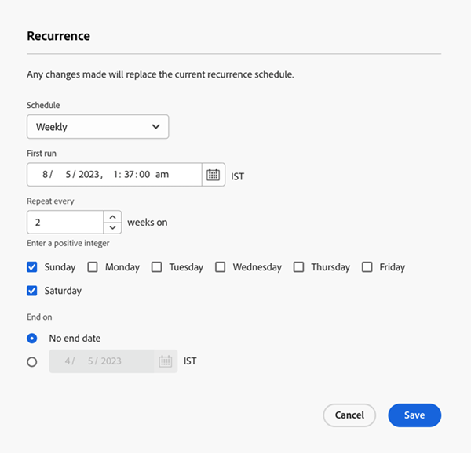

# Tabblad Instellingen {#settings-tab}

Het lusje van Montages is huis aan al uw campagnemontages, met inbegrip van de zelfde toestemmingsreeksen en toegang zoals het lusje van het Programma in Slimme Campagnes.

Het bevat de volgende drie secties.

* **Regels van de Kwalificatie**: Bepaalt hoeveel tijden elke persoon door de Slimme stroom van de Campagne kan lopen.

* **Individuele looppas**: Kan worden gebruikt om enige looppas of in de toekomst te plannen.

* **Herhaling**: Gebruikt om een dagelijkse, wekelijkse, of maandelijkse herhaling te plannen.

  

De kwalificatieregels zijn beschikbaar voor alle campagnes (trigger en batch) en bevatten de volgende instellingen:

* U kunt bepalen hoe vaak een persoon een campagne voert
* De mogelijkheid om een niet-operationele campagne te blokkeren als de persoon zijn communicatielimiet overschrijdt
* De mogelijkheid om een afbreekcampagne in te stellen die mensen beperken

  

De individuele looppas kan worden gebruikt om of een campagne onmiddellijk in werking te stellen, of om één of andere eenmalig looplooppas in de toekomst op te zetten.

>[!TIP]
>
>Het is gemakkelijker om de herhalingsmodaal te gebruiken als u een reeks campagnes plant.

De herhalingsmodale modus omvat de mogelijkheid om een terugkerend schema dagelijks, wekelijks of maandelijks in te stellen. Zodra opstelling, zult u de volgende drie looppas op het lusje van Montages kunnen zien.

Het tabblad Instellingen bevat ook een snel overzicht van uw slimme campagne. Dit omvat het volgende:

* Campagnestatus
* Gemaakt op
* Laatst gewijzigd
* Modus Slimme lijst
* Status slimme lijst:
   * Geschat aantal mensen dat getroffen zal worden
   * Geschat aantal mensen dat niet meer per e-mail kan worden ontvangen
   * Geschat aantal mensen dat wacht

Machtigingssets en fouten op het tabblad Instellingen:

Alle bestaande rechtensets zijn van toepassing op het tabblad Instellingen. Als de knop Bewerken grijs wordt weergegeven, klikt u op het Help-pictogram om uit te zoeken waarom.

>[!NOTE]
>
>Als na het klikken op het Help-pictogram &quot;Aanvullende machtigingen vereist&quot; wordt weergegeven, neemt u contact op met uw Marketo Admin.

