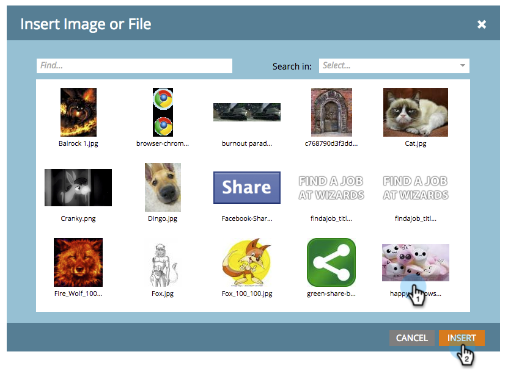

# Een achtergrondafbeelding aan een presentatie toevoegen {#add-a-background-image-to-a-presentation}

Pas een presentatie aan door een achtergrondafbeelding te selecteren.

>[!PREREQUISITES]
>
>[ creeer een Presentatie ](/help/marketo/product-docs/core-marketo-concepts/marketing-calendar/calendar-hd/create-a-presentation.md)

1. Klik met de rechtermuisknop op een presentatie en selecteer **[!UICONTROL View Setup]** .

   >[!NOTE]
   >
   >U kunt ook dubbelklikken op een presentatie om het tabblad Instellingen te openen.

   

1. Sleep **[!UICONTROL Background Image]** vanuit de rechterstructuur naar het canvas.

   

1. Selecteer een afbeelding in de afbeeldingsbibliotheek.

   >[!TIP]
   >
   >Voor de schoonste blik, gebruik een beeld dat **1920 x 1080** of **1280 x 720** is.

   

1. Klik op **[!UICONTROL Preview]** om het uit te checken.

   

   En dat is het!
