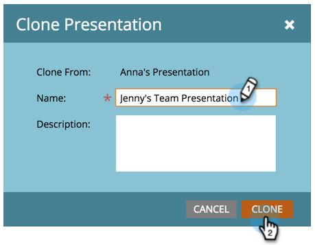

# Een presentatie klonen {#clone-a-presentation}

Een presentatie klonen voor hergebruik op verschillende plaatsen.

1. Selecteer de presentatie die u wilt klonen.

   

1. Klik met de rechtermuisknop op de presentatie en selecteer **[!UICONTROL Clone]** .

   

1. Voer een naam in voor de gekloonde presentatie en klik op **[!UICONTROL Clone]** .

   

   Geweldig! Er bestaat nu een exacte kopie van uw presentatie.
