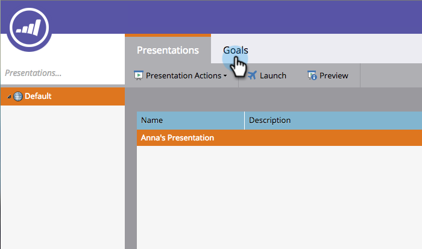
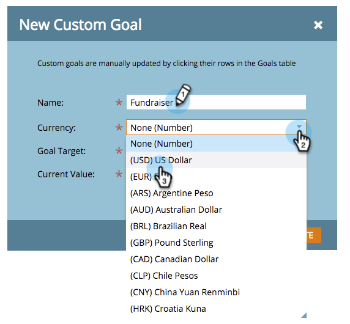
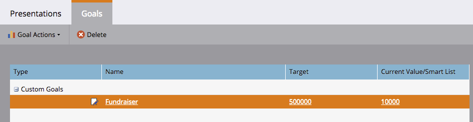

# Een aangepast doel maken {#create-a-custom-goal}

De doelstellingen zijn manieren om vooruitgang te volgen en uw team te motiveren. Nadat u ze hebt gemaakt, moeten ze handmatig worden bijgewerkt.

Als presentaties, zijn de doelstellingen [&#x200B; - specifiek &#x200B;](/help/marketo/product-docs/administration/workspaces-and-person-partitions/understanding-workspaces-and-person-partitions.md) werkruimte.

1. Ga naar de **[!UICONTROL Calendar]** .

   

1. Klik op **[!UICONTROL Presentations]** in de rechterbenedenhoek.

   

1. Selecteer het tabblad **[!UICONTROL Goals]**. 

   

1. Sleep **[!UICONTROL Custom Goal]** naar het canvas.

   

1. Voer een naam in voor het doel. Selecteer een **[!UICONTROL Currency]** .

   >[!NOTE]
   >
   >Als het doel geen monetaire waarde is, kunt u **[!UICONTROL None]** selecteren.

   

1. Ga een waarde voor **[!UICONTROL Goal Target]** en **[!UICONTROL Current Value]** in (als er geen is, ga **0** in). Klik vervolgens op **[!UICONTROL Create]** .

   

   Uw aangepaste doel is gemaakt!

   
