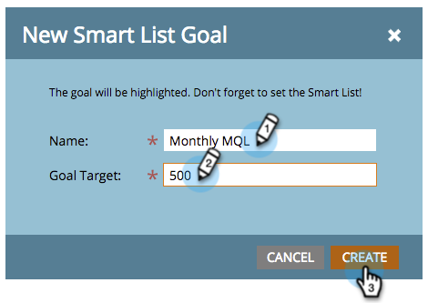

# Een slim lijstdoel maken {#create-a-smart-list-goal}

De doelstellingen zijn manieren om vooruitgang te volgen en uw team te motiveren. Ze kunnen worden gecombineerd met slimme lijsten om allerlei dingen in Marketo bij te houden. Bovendien wordt deze lijst na het instellen van een slim lijstdoel elke twee uur automatisch bijgewerkt wanneer deze wordt gebruikt in een presentatie.

Als presentaties, zijn de doelstellingen [&#x200B; - specifiek &#x200B;](/help/marketo/product-docs/administration/workspaces-and-person-partitions/understanding-workspaces-and-person-partitions.md) werkruimte.

1. Ga naar de **[!UICONTROL Calendar]** .

   

1. Klik op **[!UICONTROL Presentations]** in de rechterbenedenhoek.

   

1. Selecteer het tabblad **[!UICONTROL Goals]**. 

   

1. Sleep **[!UICONTROL Smart List Goal]** naar het canvas.

   

1. Voer een naam voor het doel in en voer een **[!UICONTROL Goal Target]** in. Klik vervolgens op **[!UICONTROL Create]** .

   

1. [&#x200B; bepaal de slimme lijst &#x200B;](/help/marketo/product-docs/core-marketo-concepts/smart-lists-and-static-lists/creating-a-smart-list/find-and-add-filters-to-a-smart-list.md). De mogelijkheden zijn eindeloos!

   

1. Als de slimme lijst eenmaal is ingesteld, klikt u op de knop **[!UICONTROL Close]** en gaat u terug naar het vorige tabblad.

   

   Kijk daar eens naar! Uw doel voor de slimme lijst is gemaakt.

   
