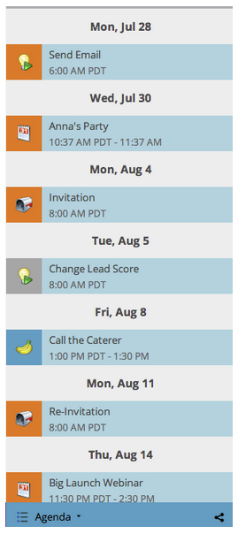

# Navigeren door de marketingkalender {#navigating-the-marketing-calendar}

U kunt gemakkelijk in de marketingkalender navigeren, maar dan wel één, twee, drie!

>[!PREREQUISITES]
>
>Zorg ervoor dat u een [Licentie voor marketingkalender](/help/marketo/product-docs/core-marketo-concepts/marketing-calendar/understanding-the-calendar/issue-revoke-a-marketing-calendar-license.md){target="_blank"} - anders verschijnt het element Marketing Calendar niet in Mijn Marketo.

1. Ga naar de **Marketingkalender**.

   

1. Dit is een vogeloogweergave van middelen die zijn gepland in je Marketo-instantie.

   

## Wijzigen tussen modi {#change-between-modes}

1. Klik op de knop **[!UICONTROL 3 weeks]** of **[!UICONTROL Month]** tabs om tussen modi te schakelen.

   

## De weergave Agenda gebruiken {#use-the-agenda-view}

In de weergave Agenda worden al uw items als een lijst weergegeven.

1. Klik op de knop **[!UICONTROL Filter]** vervolgkeuzelijst.

   

1. Selecteer **[!UICONTROL Agenda]** weergeven.

   

   Geweldig! Dit is een geweldig beeld om alles te zien wat gepland is.

   

## Navigeren door de tijd {#navigate-through-time}

Zonder DeLorean! Klik gewoon op de navigatieknoppen.

U kunt ook deze sneltoetsen gebruiken.

| Handeling | Sneltoets |
|---|---|
| Terug in de tijd | alt/opt + up |
| Voorwaarts in de tijd | alt/opt + down |
| Ga naar &quot;vandaag&quot; | alt/opt + t |

Geweldig! Dit zijn de basisbeginselen. U kunt de weergave ook met filters aanpassen.

>[!MORELIKETHIS]
>
>[De marketingkalender filteren](/help/marketo/product-docs/core-marketo-concepts/marketing-calendar/working-with-the-calendar/filtering-the-marketing-calendar.md){target="_blank"}
