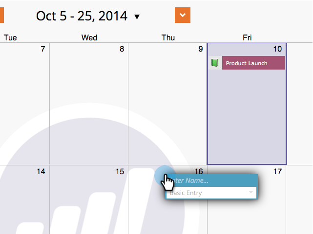

# Directe items maken in de marketingkalender {#create-entries-directly-in-the-marketing-calendar}

Met Marketo kunt u rechtstreeks in uw Marketingkalender items maken met de modus voor programmafocus. U kunt de volgende ingstypen maken:

* Basisinvoer
* Aangepaste items
* E-mailprogramma&#39;s
* Slimme campagnes

Zo gaat het.

1. Ga naar **Kalender**.

   

1. Selecteer een vorige ingang en klik **Toon de Nadruk van het Programma**.

   

1. Selecteer in de focusmodus van het programma de dag van uw keuze om een item toe te voegen.

   

1. Geef een naam op voor de invoer en selecteer een type.

   

   >[!TIP]
   >
   >U kunt **Slimme campagnes**, **E-mailprogramma&#39;s** en **Basisitems** op dezelfde manier maken.

1. Sluit de focusmodus van het programma wanneer u klaar bent met bewerken.

   

>[!MORELIKETHIS]
>
>[Items rechtstreeks in de marketingkalender bewerken](edit-entries-directly-in-the-marketing-calendar.md)
