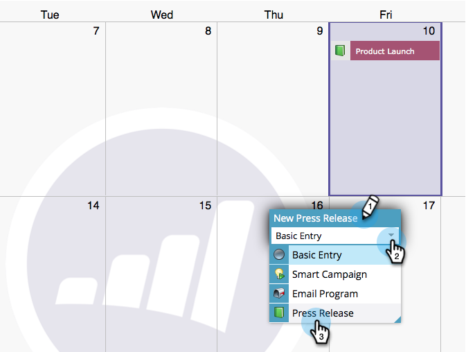

# Items rechtstreeks maken in de marketingkalender {#create-entries-directly-in-the-marketing-calendar}

Met Marketo kunt u rechtstreeks in uw Marketingkalender items maken met behulp van de modus voor programmafocus. U kunt de volgende ingstypen maken:

* Basisinvoer
* Aangepaste items
* E-mailprogramma&#39;s
* Slimme campagnes

1. Klik op de tegel **[!UICONTROL Calendar]** .

   

1. Selecteer een vorige vermelding en klik op **[!UICONTROL Show Program Focus]** .

   

1. Selecteer in de focusmodus van het programma de dag van uw keuze om een item toe te voegen.

   

1. Geef een naam op voor de invoer en selecteer een type.

   

   >[!TIP]
   >
   >Bericht u kunt **Slimme Campagnes**, **E-mailProgramma&#39;s** en **BasisIngangen** op deze zelfde manier ook tot stand brengen.

1. Sluit de focusmodus van het programma wanneer u klaar bent met bewerken.

   

>[!MORELIKETHIS]
>
>[ geef Ingangen direct in de Kalender van de Marketing uit ](/help/marketo/product-docs/core-marketo-concepts/marketing-calendar/working-with-the-calendar/edit-entries-directly-in-the-marketing-calendar.md){target="_blank"}
