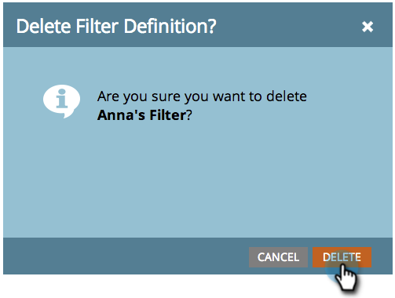

# Een filter verwijderen in de marketingkalender {#deleting-a-filter-in-the-marketing-calendar}

Als u een filter in de Kalender van de Marketing wilt schrappen, bent u aan de juiste plaats gekomen.

1. Selecteer het filter dat u wilt verwijderen.

   

1. Klik rood **x**.

   

1. Klik op **[!UICONTROL Delete]** om te bevestigen.

   
