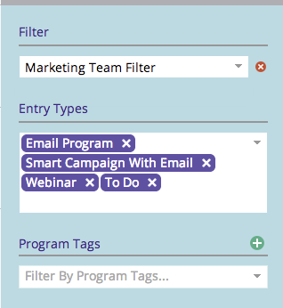

# Een filterdefinitie opslaan in de marketingkalender {#saving-a-filter-definition-in-the-marketing-calendar}

Door een filter op te slaan kunt u schakelen tussen verschillende filterdefinities.

>[!PREREQUISITES]
>
>[ Filtrerend de Kalender van de Marketing ](/help/marketo/product-docs/core-marketo-concepts/marketing-calendar/working-with-the-calendar/filtering-the-marketing-calendar.md){target="_blank"}

1. Definieer het filter.

   

1. Klik op het pictogram Opslaan.

   

1. Geef het filter een naam. Klik op **[!UICONTROL Save]**.

   

   Het filter wordt nu opgeslagen.

   

   Als u wilt, kunt u [ een exemplaar ](/help/marketo/product-docs/core-marketo-concepts/marketing-calendar/working-with-the-calendar/sharing-a-filter-definition-in-the-marketing-calendar.md){target="_blank"} van de definitie naar andere gebruikers van Marketo verzenden.

   >[!NOTE]
   >
   >[ het Delen van een Definitie van de Filter in de Kalender van de Marketing ](/help/marketo/product-docs/core-marketo-concepts/marketing-calendar/working-with-the-calendar/sharing-a-filter-definition-in-the-marketing-calendar.md){target="_blank"}
