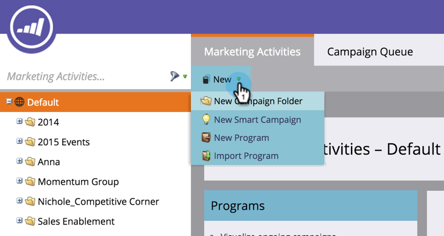

# Nieuwe campagnemap maken {#create-new-campaign-folder}

Campagnemappen helpen u een moeilijke werkruimte te houden. Volg deze eenvoudige stappen en je bent op weg naar automatisering magie.

1. Ga naar **[!UICONTROL Marketing Activities]** .

   

1. Selecteer **[!UICONTROL New]**.

   

1. Selecteer **[!UICONTROL New Campaign Folder]**.

   

1. Voer een **[!UICONTROL Name]** in voor de campagnemap.

   

1. Optioneel: voer een **[!UICONTROL Description]** in en klik op **[!UICONTROL Create]** .

   >[!TIP]
   >
   >De beschrijvingen zijn voor andere gebruikers op het abonnement. Uw klanten zullen dit bericht niet zien.

   

   Geweldig! U hebt zojuist een map voor de campagne gemaakt. Bekijk het in de boom.

   

   Nu wanneer [ creërend een nieuw programma ](/help/marketo/product-docs/core-marketo-concepts/programs/creating-programs/create-a-program.md), zult u deze campagnemap als optie zien.

>[!MORELIKETHIS]
>
>* [ creeer een Programma ](/help/marketo/product-docs/core-marketo-concepts/programs/creating-programs/create-a-program.md)
>* [ creeer een Nieuwe Slimme Campagne ](/help/marketo/product-docs/core-marketo-concepts/smart-campaigns/creating-a-smart-campaign/create-a-new-smart-campaign.md)
