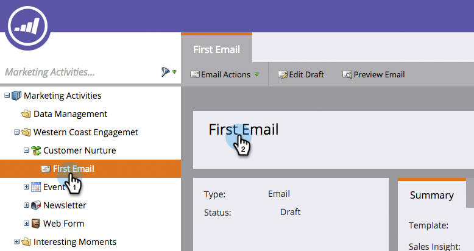

# De naam van een Marketo-element wijzigen {#rename-a-marketo-asset}

U kunt de namen van mappen, programma&#39;s en lokale elementen gemakkelijk wijzigen.

1. Selecteer een element waarvan u de naam wilt wijzigen en klik op het naamblok van het rechterdeelvenster.

   

1. Typ een nieuwe naam in het tekstveld. Klik **Opslaan**.

   

   >[!NOTE]
   >
   >U kunt de namen van geüploade bestanden en afbeeldingen of elementen waarnaar momenteel wordt verwezen in een slimme lijst of slimme campagne (in filters, triggers, flowstappen, enzovoort) niet wijzigen.
