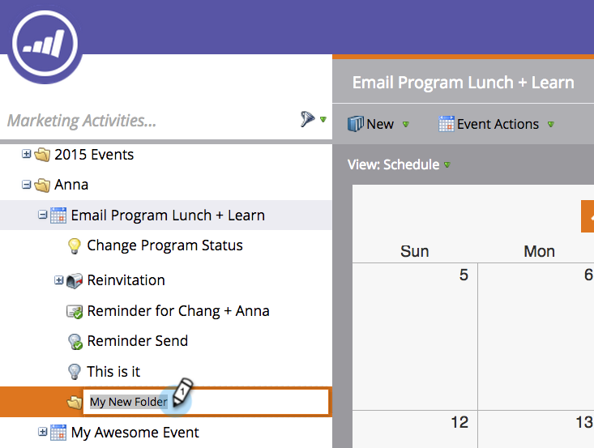

# Mappen begrijpen {#understanding-folders}

Mappen in een programma kunnen worden gebruikt om slimme campagnes en middelen te organiseren. Deze verschillen van [campagnemappen](/help/marketo/product-docs/core-marketo-concepts/miscellaneous/create-new-campaign-folder.md).

## Een map maken {#create-a-folder}

1. Ga naar de **[!UICONTROL Marketing Activities]** gebied.

   

1. Klik met de rechtermuisknop op een programma en selecteer **[!UICONTROL New Folder]**.

   

1. Geef de nieuwe map een naam en druk op **[!UICONTROL Enter]**.

   

Geweldig! Nu hebt u een nieuwe map waarin u uw lokale elementen kunt opslaan.

## De naam van een map wijzigen {#rename-a-folder}

Het is oké om van gedachten te veranderen.

1. Klik met de rechtermuisknop op de map en selecteer **[!UICONTROL Rename Folder]**.

   

1. Typ een nieuwe naam en druk op **[!UICONTROL Enter]**.

   

## Een map verwijderen {#delete-a-folder}

>[!NOTE]
>
>Zorg ervoor dat de map leeg is voordat u deze verwijdert.

1. Klik met de rechtermuisknop op de map en selecteer **[!UICONTROL Delete Folder]**.

   

## Een map archiveren {#archive-a-folder}

In Marketo kunt u bestaande mappen converteren naar Archiefmappen. De omslagen van het archief bestaan in de Activiteiten van de Marketing, Gegevensbestand, en Studio van het Ontwerp.

Wanneer u een map archiveert:

* De map en elementen zijn niet meer zichtbaar in de zoekresultaten. Als u zoekt naar een programma of gebeurtenis in een gearchiveerde map, wordt een samengevouwen weergave van de gearchiveerde map geretourneerd
* De elementen in de map worden niet meer weergegeven in de automatische melding
* Gearchiveerde sjablonen zijn niet beschikbaar wanneer u een e-mail- of landingspagina maakt in Design Studio
* Gearchiveerde pagina's kunnen niet worden gebruikt in testgroepen voor bestemmingspagina's

Functionaliteit die **niet** wijzigen bij archiveren:

* Globale zoekopdracht vindt nog steeds resultaten in gearchiveerde mappen
* Een actief dat in gebruik is, blijft werken zelfs nadat het is gearchiveerd
* Met een filter kunt u gearchiveerde elementen selecteren voor gebruik in rapporten
* Gearchiveerde elementen worden niet gedeactiveerd. Ze moeten ook worden gedeactiveerd als u wilt dat ze niet meer worden uitgevoerd
