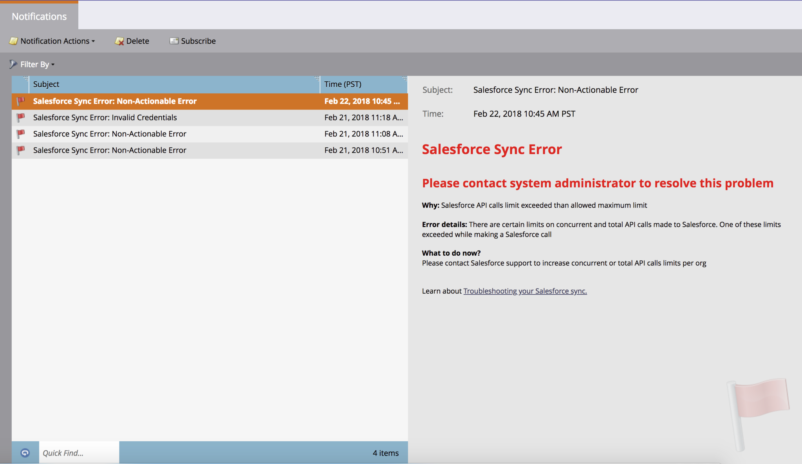
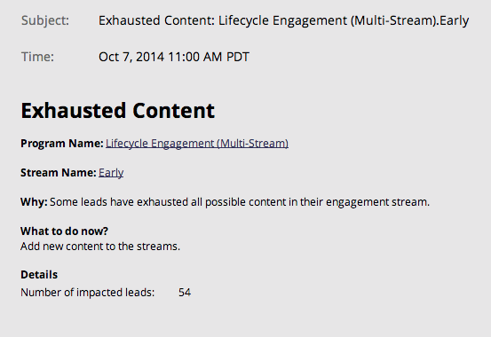
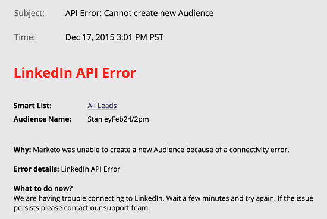

# Typen meldingen {#notification-types}

Er zijn verschillende meldingstypen.

## Campagne mislukt  {#campaign-failure}

Fouten tijdens de campagne geven u een melding van fouten in uw slimme campagnes.

## CRM-synchronisatie {#crm-sync}

CRM-synchronisatieberichten geven een waarschuwing voor kritieke problemen die zich voordoen bij de CRM-synchronisatie, zoals onjuiste machtigingen of het neerzetten van de synchronisatie.

**[!DNL Microsoft Dynamics]**

[!DNL Dynamics] -meldingen worden elke 24 uur verzonden en bevatten leads die in die periode niet konden worden gesynchroniseerd. Typische oorzaken van een fout zijn dubbele leads (zoals hierboven) of onjuiste afstemmingen in de veldlengte.

**[!DNL Salesforce]**

Als u [!DNL Salesforce] gebruikt, zien synchronisatiefoutenmeldingen er ongeveer zo uit als hieronder. Typische fouten zijn verlopen gegevens en overschrijden de API-limieten.

## Betrokkenheid {#engagement}

Wanneer mensen uitgeput raken in een stroom, sturen wij een bericht. De kennisgeving bevat het aantal personen dat is uitgeput en enige andere informatie.

## Facebook {#facebook}

Als u mensen naar Facebook probeert te sturen zonder de servicevoorwaarden te accepteren, of als u mensen naar Facebook probeert te sturen nadat u de Marketo-app hebt verwijderd.

## Opruimen van campagne voor inactieve Trigger {#idle-trigger-campaign-cleanup}

Deactivate teweeggebrachte Slimme Campagnes die geen activiteit meer krijgen. Leer meer over [&#x200B; automatische opruiming van de trekkercampagne &#x200B;](/help/marketo/product-docs/core-marketo-concepts/smart-campaigns/using-smart-campaigns/automatic-trigger-campaign-cleanup.md).

## LinkedIn {#linkedin}

Als Marketo na drie pogingen geen nieuw publiek kan maken, meldt u zich aan of drukt u op e-mails naar LinkedIn.

## Webservices {#web-services}

U wordt op de hoogte gesteld wanneer u uw dagelijkse quotum bereikt. De quota worden elke nacht opnieuw ingesteld om middernacht, Centrale Tijd.

>[!NOTE]
>
>Sommige foutencodes u kunt ontvangen worden geschetst in onze [&#x200B; Documentatie van de Ontwikkelaar &#x200B;](https://experienceleague.adobe.com/en/docs/marketo-developer/marketo/rest/error-codes).
