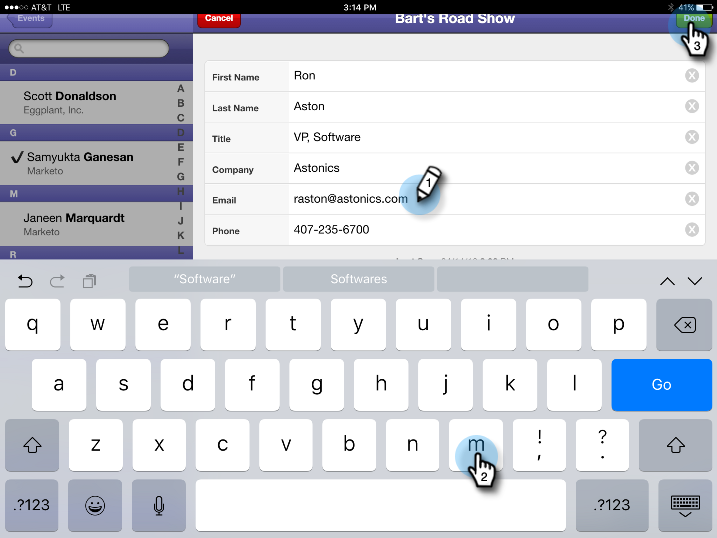

# Personen in uw gebeurtenis controleren via uw tablet {#check-people-into-your-event-from-your-tablet}

Wanneer mensen bij de gebeurtenis verschijnen, kunt u hun informatie in de app vinden. Na inchecken krijgen ze de status Bijgewoond wanneer u ze synchroniseert met Marketo.

De app werkt op zowel de iPad als op Android hetzelfde, behalve voor kleine layout- en ontwerpverschillen.

>[!NOTE]
>
>**FYI**
>
>Marketo is nu bezig met het standaardiseren van de taal voor alle abonnementen, dus u ziet mogelijk leads/leads in uw abonnement en personen/personen in docs.marketo.com. Deze termen betekenen hetzelfde. het heeft geen invloed op de instructies van het artikel . Er zijn nog enkele andere veranderingen. [Meer](http://docs.marketo.com/display/DOCS/Updates+to+Marketo+Terminology)informatie.

>[!PREREQUISITES]
>
>* Maak een gebeurtenis in Marketo en vul deze met Uitgenodigde en geregistreerde personen.
>* Download de tablet-app voor [Android](https://play.google.com/store/apps/details?id=com.marketo.eventcheckin&amp;hl=en) of [iOS](https://itunes.apple.com/us/app/marketo-events/id522766637?mt=8)

>

## Geregistreerde gasten inchecken {#check-in-registered-guests}

1. Tik op het app-pictogram op uw iPad- of Android-tablet.
1. Tik op **Aanmelden** om de app Marketo Event te starten.

   

1. Voer uw gebruikersnaam en wachtwoord voor Marketo in en klik op **Aanmelden**.

   >[!NOTE]
   >
   >U moet een rol met toegang tot het Gegevensbestand hebben om mensen in app te zien.

1. Selecteer een **gebeurtenis**.

   

   >[!TIP]
   >
   >Alleen gebeurtenisprogramma&#39;s (met uitzondering van webinars) die een week voor en een week na de datum van vandaag zijn gepland, worden weergegeven.

1. Blader in het scherm Home om geregistreerde gasten te zoeken. Als u een persoon in de lijst wilt zoeken, kunt u:

   * Schuiven om een naam te zoeken
   * Een naam invoeren in het zoekveld
   * Naar een bepaalde beginletter van de achternaam springen door erop te tikken aan de rechterkant van de lijst

   >[!NOTE]
   >
   >Het proces is hetzelfde op iPad en Android, maar de schermen verschillen en de items kunnen zich op verschillende locaties bevinden. Dit artikel heeft de iPad-interface. Vergelijk het Android-scherm in deze sectie ter referentie.

   **iPad** 

   **Android**

   

1. Tik op de geselecteerde naam en tik op de naam van de persoon in de record op **Inchecken**.

   

De gast heeft nu de status Bijgewoond, en ontvangt een vinkje. De persoonrecord wordt bijgewerkt wanneer u synchroniseert met Marketo. De rode teller op de knoop van de Synchronisatie stijgt om het aantal controles sinds laatste synchronisatie met Marketo te tonen. De knop Sync ziet er anders uit en bevindt zich op een andere locatie voor iPad en Android:

**iPad**

**Android**

>[!TIP]
>
>Als een persoon is uitgenodigd maar niet geregistreerd, kunt u naar de naam zoeken door op **Zoeken op server**, net onder het vak Zoeken te klikken. De status Uitgenodigd verandert in **Bijgewoond** voor de gebeurtenis.

## Een nieuwe persoon op de tablet maken {#create-a-new-person-on-the-tablet}

U kunt gasten manueel toevoegen die geen bestaande mensen in uw gegevensbestand Marketo zijn. Deze worden automatisch ingecheckt en toegevoegd aan uw database wanneer u synchroniseert met Marketo.

1. Klik op **Toevoegen**.

   **iPad**

   

   **Android**

   

1. Vul zoveel mogelijk basisinformatievelden in als u kunt en tik op **Gereed**.

   

   >[!NOTE]
   >
   >U kunt alleen de bestaande velden gebruiken. U kunt geen aangepaste bestanden maken.

   >[!CAUTION]
   >
   >Controleer het e-mailadres. Andere gebieden kunnen later worden verbeterd, maar het e-mailadres is de primaire methode om de gast te contacteren.

De nieuwe persoon is geregistreerd als ingecheckt bij uw gebeurtenis en wordt toegevoegd aan de database Marketo met de status Bijgevoegd wanneer u synchroniseert met Marketo.

## Een inchecken omkeren {#reverse-a-check-in}

Als u per ongeluk iemand hebt ingecheckt, *voordat u markeert*, kunt u de status Bijgevoegd omkeren.

1. Tik op de naam in de lijst en tik in de opgenomen persoon op **Ongedaan maken**.

   

   Alles opgelost!

## Een personenrecord bewerken bij inchecken {#edit-a-person-record-at-check-in}

U kunt gastinformatie, juist bij de gebeurtenis toevoegen en wijzigen!

1. Tik op de naam in de personenlijst en tik op **Bewerken**.

   

1. Bewerk de velden en voeg informatie toe. Tik vervolgens op **Gereed**.

   

   >[!NOTE]
   >
   >In Android is de knop **Gereed** mogelijk verborgen. Schuif omlaag om het te zoeken.

De informatie wordt bijgewerkt wanneer u de app synchroniseert met Marketo.

## App synchroniseren met Marketo {#sync-the-app-with-marketo}

De app Marketo Events werkt onafhankelijk totdat u uw activiteit weer synchroniseert met de Marketo-database. Synchroniseer zo snel mogelijk na de laatste inchecking. Uw tablet moet zijn verbonden met internet.

>[!CAUTION]
>
>Nadat u hebt gesynchroniseerd, kunt u een inchecken niet meer omkeren vanuit de app.

1. Open de app op uw tablet en navigeer naar de gebeurtenis.
1. Tik op **Synchroniseren**.

   Uw gebeurtenis wordt bijgewerkt met nieuwe controles in het gegevensbestand van de Marketo. De rode teller op de knoop van de Synchronisatie ontruimt, tot u iemand anders binnen controleert.

   Om veiligheidsredenen moet u de app Marketo Events afsluiten nadat u de synchronisatie hebt voltooid.

## Werken met beperkte internettoegang {#working-with-limited-internet-access}

Sommige locaties hebben slechte internettoegang. U hebt een goede verbinding nodig met:

* De app downloaden en installeren
* Aanmelden
* Een gebeurtenis selecteren
* App synchroniseren met Marketo

Als u zich zorgen maakt over internettoegang op de locatie, kunt u zich aanmelden bij de app Marketo Events en uw gebeurtenis vooraf selecteren op een locatie met sterke internettoegang. Op die manier kunt u de app nog steeds offline gebruiken. Wanneer u vervolgens weer een internetverbinding maakt, synchroniseert u onmiddellijk naar de Marketo-database.

>[!TIP]
>
>Als u geen internetverbinding hebt, kunt u nog steeds een nieuwe persoon maken die incheckt. De toepassing is compatibel met de bestaande persoon wanneer u de app synchroniseert.

>[!NOTE]
>
>De app meldt u automatisch af na acht uur inactiviteit.

