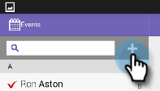

# Personen in uw gebeurtenis controleren via uw tablet {#check-people-into-your-event-from-your-tablet}

Wanneer mensen bij de gebeurtenis verschijnen, kunt u hun informatie in de app vinden. Na de inchecking wordt de status Bijgewoond bevorderd wanneer u synchroniseert met Marketo.

>[!IMPORTANT]
>
>Op 2 oktober 2023 heeft Adobe de Marketo Events App uit alle App Stores verwijderd. Als de app al op uw tablet/mobiel apparaat is geïnstalleerd, kunt u deze voorlopig blijven gebruiken. Zodra uw exemplaar van het Marketo Engage aan Adobe Identiteit voor authentificatie van Marketo wordt gemigreerd, zult u niet meer tot app kunnen toegang hebben. [Meer informatie](https://nation.marketo.com/t5/product-discussions/marketo-events-app-and-marketo-moments-app-end-of-life/m-p/340712/highlight/true#M193869){target="_blank"}.

De app werkt op zowel iPad als Android op dezelfde manier, behalve voor kleine layout- en ontwerpverschillen.

>[!PREREQUISITES]
>
>* Maak een gebeurtenis in Marketo en vul deze met Uitgenodigde en Geregistreerde personen.

## Geregistreerde gasten inchecken {#check-in-registered-guests}

1. Tik op het app-pictogram op uw iPad- of Android-tablet.

1. Tikken **Aanmelden** om de Marketo Event-app te starten.

   

1. Voer uw Marketo-gebruikersnaam en -wachtwoord in en klik op **Aanmelden**.

   >[!NOTE]
   >
   >U moet een rol met toegang tot het Gegevensbestand hebben om mensen in app te zien.

1. Selecteer een **Gebeurtenis**.

   

   >[!TIP]
   >
   >Alleen gebeurtenisprogramma&#39;s (met uitzondering van webinars) die een week voor en een week na de datum van vandaag zijn gepland, worden weergegeven.

1. Blader in het scherm Home om geregistreerde gasten te zoeken. Als u een persoon in de lijst wilt zoeken, kunt u:

   * Schuiven om een naam te zoeken
   * Een naam invoeren in het zoekveld
   * Naar een bepaalde beginletter van de achternaam springen door erop te tikken aan de rechterkant van de lijst

   >[!NOTE]
   >
   >Het proces is hetzelfde op iPad en Android, maar de schermen verschillen en de items kunnen zich op verschillende locaties bevinden. In dit artikel wordt de iPad-interface weergegeven. Vergelijk het Android-scherm in deze sectie ter referentie.

   **iPad**

   

   **Android**

   

1. Tik op de geselecteerde naam en tik in de persoonlijke record op **Inchecken**.

   

De gast heeft nu de status Bijgewoond, en ontvangt een vinkje. De persoonrecord wordt bijgewerkt wanneer u synchroniseert met Marketo. De rode teller op de knoop van de Synchronisatie stijgt om het aantal controles sinds laatste synchronisatie met Marketo te tonen. De knop Sync ziet er anders uit en bevindt zich op een andere locatie voor iPad en Android:

**iPad**

**Android**

>[!TIP]
>
>Als een persoon is uitgenodigd maar niet is geregistreerd, kunt u naar de naam zoeken door op **Zoeken op de server**, net onder het vak Zoeken. De status Uitgenodigd verandert in **Bijgewoond** voor de gebeurtenis.

## Een nieuwe persoon op de tablet maken {#create-a-new-person-on-the-tablet}

U kunt gasten handmatig toevoegen die geen bestaande personen zijn in uw Marketo-database. Deze worden automatisch ingecheckt en toegevoegd aan uw database wanneer u synchroniseert met Marketo.

1. Klikken **Toevoegen**.

   **iPad**

   

   **Android**

   

1. Vul zo veel mogelijk basisinformatievelden in en tik op **Gereed**.

   

   >[!NOTE]
   >
   >U kunt alleen de bestaande velden gebruiken. U kunt geen aangepaste bestanden maken.

   >[!CAUTION]
   >
   >Controleer het e-mailadres. Andere gebieden kunnen later worden verbeterd, maar het e-mailadres is de primaire methode om de gast te contacteren.

De nieuwe persoon is geregistreerd als ingecheckt bij uw gebeurtenis en wordt toegevoegd aan de Marketo-database met de status Bijgevoegd wanneer u synchroniseert met Marketo.

## Een inchecken omkeren {#reverse-a-check-in}

Als u per ongeluk iemand hebt ingecheckt, _voordat u synchroniseert met Marketo_ kunt u de status Bijgewoond omkeren.

1. Tik op de naam in de lijst en tik in de persoonlijke record op **Ongedaan maken**.

   

   Alles opgelost!

## Een personenrecord bewerken bij inchecken {#edit-a-person-record-at-check-in}

U kunt gastinformatie, juist bij de gebeurtenis toevoegen en wijzigen!

1. Tik op de naam in de personenlijst en tik op **Bewerken**.

   

1. Bewerk de velden en voeg informatie toe. Tik vervolgens op **Gereed**.

   

   >[!NOTE]
   >
   >In Android worden de **Gereed** kan verborgen zijn. Schuif omlaag om het te zoeken.

De informatie wordt bijgewerkt wanneer u de app synchroniseert met Marketo.

## De app synchroniseren met Marketo {#sync-the-app-with-marketo}

De Marketo Events-app werkt onafhankelijk totdat u uw activiteit weer synchroniseert met de Marketo-database. Synchroniseer zo snel mogelijk na de laatste inchecking. Uw tablet moet zijn verbonden met internet.

>[!CAUTION]
>
>Nadat u hebt gesynchroniseerd, kunt u een inchecken niet meer omkeren vanuit de app.

1. Open de app op uw tablet en navigeer naar de gebeurtenis.

1. Tikken **Sync**.

   Uw gebeurtenis wordt bijgewerkt met nieuwe inchecken in de Marketo-database. De rode teller op de knoop van de Synchronisatie ontruimt, tot u iemand anders binnen controleert.

   Om veiligheidsredenen moet u de Marketo Events-app afsluiten nadat u de synchronisatie hebt voltooid.

## Werken met beperkte internettoegang {#working-with-limited-internet-access}

Sommige locaties hebben slechte internettoegang. U hebt een goede verbinding nodig met:

* De app downloaden en installeren
* Aanmelden
* Een gebeurtenis selecteren
* De app synchroniseren met Marketo

Als u zich zorgen maakt over internettoegang op de locatie, kunt u zich aanmelden bij de Marketo Events-app en uw gebeurtenis vooraf selecteren op een locatie met sterke internettoegang. Zo kunt u de app nog steeds offline gebruiken. Wanneer u vervolgens weer een internetverbinding maakt, moet u deze meteen synchroniseren met de Marketo-database.

>[!TIP]
>
>Als u geen internetverbinding hebt, kunt u nog steeds een nieuwe persoon maken die incheckt. De toepassing is compatibel met de bestaande persoon wanneer u de app synchroniseert.

>[!NOTE]
>
>De app meldt u automatisch af na acht uur inactiviteit.
