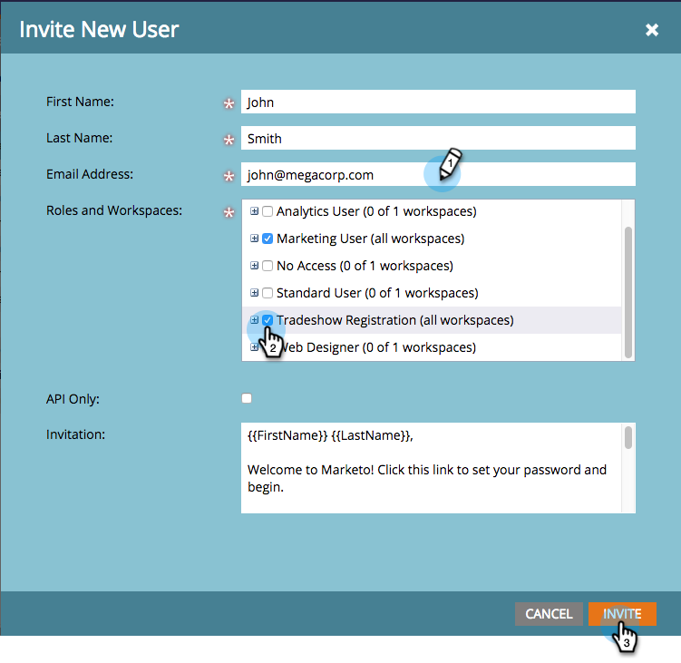

# Gebruikers toegang verlenen tot de Check-in-app {#grant-users-access-to-the-check-in-app}

Marketo Engage heeft een speciale gebruikersrol voor de app voor het inchecken van gebeurtenissen. Hieronder wordt beschreven hoe u een nieuwe rol kunt maken met toestemming om de app te gebruiken.

>[!IMPORTANT]
>
>Op 2 oktober 2023 heeft Adobe de Marketo Events App uit alle App Stores verwijderd. Als de app al op uw tablet/mobiel apparaat is geïnstalleerd, kunt u deze voorlopig blijven gebruiken. Zodra uw Marketo Engage-exemplaar is gemigreerd naar Adobe Identity voor verificatie van Marketo, hebt u geen toegang meer tot de app. [ leer meer ](https://nation.marketo.com/t5/product-discussions/marketo-events-app-and-marketo-moments-app-end-of-life/m-p/340712/highlight/true#M193869){target="_blank"}.

## Nieuwe gebruikersrol maken voor mobiele apparaten {#create-a-new-user-role-for-mobile}

1. Klik op **[!UICONTROL Admin]**.

   

1. Klik op **[!UICONTROL Users & Roles]**.

   

1. Klik op de tab **[!UICONTROL Roles]** en klik vervolgens op **[!UICONTROL New Role]** .

   

1. Voer een naam in voor de nieuwe rol en een optionele beschrijving. Controleer het vak **[!UICONTROL Access Mobile Application]** en klik op **[!UICONTROL Create]** .

   

   De nieuwe rol kan worden toegewezen wanneer u mensen uitnodigt om de tablet-app te gebruiken.

## Nieuwe gebruikers uitnodigen voor de Inchecken-app {#invite-new-users-for-the-check-in-app}

1. Klik op de tab **[!UICONTROL Users]** .

   

1. Klik op **[!UICONTROL Invite New User]**.

   

1. Voer de gegevens van de nieuwe gebruiker in. Selecteer de selectievakjes voor alle relevante rollen en de nieuwe rol met toestemming om de mobiele app te openen. Klik op **[!UICONTROL Invite]** wanneer u klaar bent.

   

   >[!CAUTION]
   >
   >Gebruikers die geen toegang hebben tot de database kunnen geen personen in de app zien.

   >[!TIP]
   >
   >Voor bestaande gebruikers kunt u een nieuwe rol maken of de machtiging [!UICONTROL Access Mobile Application] toevoegen aan de huidige rol.

De gebruiker ontvangt een e-mail waarin hij of zij toegang heeft tot de incheckapp.
