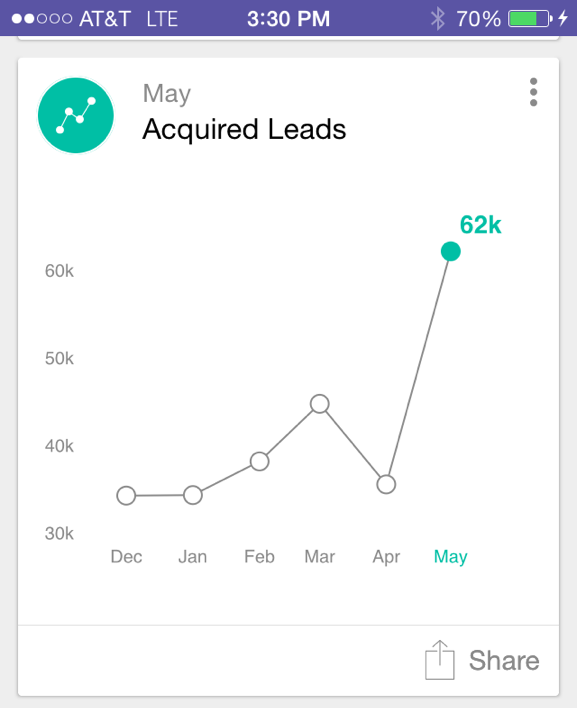

# Analysecards {#understanding-analytics-cards}

Aan het begin van elke maand biedt Marketo Moments drie verschillende rapportkaarten: [!UICONTROL Acquired Leads] , [!UICONTROL New Leads] en [!UICONTROL Unsubscribes] . Elk voorbeeld toont je maandelijkse prestaties en de trend over een periode van zes maanden.

>[!IMPORTANT]
>
>Op 2 oktober 2023 heeft Adobe de Marketo Moments App uit alle App Stores verwijderd. Als de app al op uw tablet/mobiel apparaat is geïnstalleerd, kunt u deze voorlopig blijven gebruiken. Zodra uw Marketo Engage-exemplaar is gemigreerd naar Adobe Identity voor verificatie van Marketo, hebt u geen toegang meer tot de app. [ leer meer ](https://nation.marketo.com/t5/product-discussions/marketo-events-app-and-marketo-moments-app-end-of-life/m-p/340712/highlight/true#M193869){target="_blank"}.

## Kaarten voor analyse {#analytics-cards}

Als u op een analysekaart tikt, kunt u:

* [Maak er een favoriet van](/help/marketo/product-docs/core-marketo-concepts/mobile-apps/marketo-moments/working-with-moments/creating-a-favorite.md)
* [Markeren als voltooid](/help/marketo/product-docs/core-marketo-concepts/mobile-apps/marketo-moments/working-with-moments/marking-it-done.md)
* [Delen](/help/marketo/product-docs/core-marketo-concepts/mobile-apps/marketo-moments/working-with-moments/sharing-a-moment.md)

Tik op de analytische kaart die u wilt weergeven:

* Een grafiek voor de resultaten van de laatste zes maanden
* Een maand-over maandvergelijking
* Een staafdiagram van de meeste of bovenste drie (afhankelijk van de kaart)

Bekijk bijvoorbeeld de details van de [!UICONTROL Acquired Leads] Analytics-kaart:

In dit voorbeeld geeft rood aan dat de waarde is verlaagd over het geselecteerde datumbereik (oh!). Groen geeft aan dat de waarde is verhoogd (jay!).

## [!UICONTROL Acquired Leads] {#acquired-leads}

Op de **[!UICONTROL Acquired Leads]** -kaart ziet u een trending month-over-month rapport van het aantal nieuwe leads.

>[!NOTE]
>
>Alleen leads met een gedefinieerd overnameprogramma zijn zichtbaar.

## [!UICONTROL New Leads] {#new-leads}

Op de **[!UICONTROL New Leads]** -kaart ziet u een trending month-over-month rapport van het totale aantal nieuwe leads in uw exemplaar in de afgelopen zes maanden.

## [!UICONTROL Unsubscribes] {#unsubscribes}

Op de kaart van **[!UICONTROL Unsubscribes]** wordt een trending report van meer dan een maand weergegeven van de afmeldingsfrequentie van de afgelopen zes maanden.

>[!MORELIKETHIS]
>
>* [ Begrijpend de Momenten van Marketo ](/help/marketo/product-docs/core-marketo-concepts/mobile-apps/marketo-moments/understanding-moments/understanding-marketo-moments.md)
>* [ Begrijpend de Kaarten van de Gebeurtenis ](/help/marketo/product-docs/core-marketo-concepts/mobile-apps/marketo-moments/understanding-moments/understanding-event-cards.md)
>* [ Begrijpend de Kaarten van het E-mailProgramma ](/help/marketo/product-docs/core-marketo-concepts/mobile-apps/marketo-moments/understanding-moments/understanding-email-program-cards.md)
