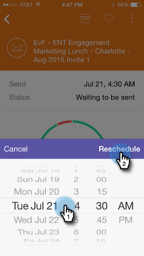

# E-mailprogrammakaarten {#understanding-email-program-cards}

Marketo Moments gebruiken om uw e-mailprogramma&#39;s te bekijken vanaf uw telefoon of iPad.

>[!IMPORTANT]
>
>Op 2 oktober 2023 heeft Adobe de Marketo Moments App uit alle App Stores verwijderd. Als de app al op uw tablet/mobiel apparaat is geïnstalleerd, kunt u deze voorlopig blijven gebruiken. Zodra uw exemplaar van het Marketo Engage aan Adobe Identiteit voor authentificatie van Marketo wordt gemigreerd, zult u niet meer tot app kunnen toegang hebben. [Meer informatie](https://nation.marketo.com/t5/product-discussions/marketo-events-app-and-marketo-moments-app-end-of-life/m-p/340712/highlight/true#M193869){target="_blank"}.

## E-mailprogrammakaarten {#email-program-cards}

Wanneer u op een e-mailprogrammakaart tikt, kunt u:

* [Een e-mailadres als favoriet instellen](/help/marketo/product-docs/core-marketo-concepts/mobile-apps/marketo-moments/working-with-moments/creating-a-favorite.md)
* [Een e-mail markeren zoals deze is voltooid](/help/marketo/product-docs/core-marketo-concepts/mobile-apps/marketo-moments/working-with-moments/marking-it-done.md)
* [Een e-mailgebeurtenissenkaart delen](/help/marketo/product-docs/core-marketo-concepts/mobile-apps/marketo-moments/working-with-moments/sharing-a-moment.md)

Op een e-mailprogrammakaart voor een e-mailbericht dat nog niet is verzonden, vindt u informatie over de status en het publiek van dat e-mailprogramma.

Nadat de e-mail is verzonden, geeft de kaart andere waardevolle informatie weer, zoals het aantal geleverde e-mails, de acties van de ontvangers en een koppeling naar de slimme lijst die in de campagne wordt gebruikt.

## Een e-mailkaart bevestigen {#confirming-an-email-card}

1. Tik op het driepuntmenu om een niet-bevestigde e-mailkaart te bevestigen.

   

1. Tikken **Bevestigen**.

   

1. Tikken **Bevestigen** om de taak te voltooien, of **Nooit denken** als je tweede gedachten had.

   

   >[!NOTE]
   >
   >Nu gaat je kaart naar oranje!

## E-mailkaartverzending annuleren {#canceling-an-email-card-send}

1. Tik op het driepuntmenu als u uw bevestigde e-mail niet wilt verzenden.

   

1. Tikken **Verzenden annuleren**.

   

## Een e-mailkaart opnieuw selecteren {#rescheduling-an-email-card}

Je kunt bevestigde of onbevestigde e-mailkaarten opnieuw plannen.

>[!NOTE]
>
>Voor e-mailberichten die al zijn bevestigd, moet u het e-mailbericht eerst annuleren (zie hieronder).

1. Tik op het driepuntmenu om een e-mailbericht opnieuw te plannen.

   

1. Tikken **Opnieuw plannen**.

   

1. Selecteer een datum op de kalender en tik op **Opnieuw plannen**.

   

   Zolang u de draadloze dienst hebt, kunt u van overal opnieuw plannen!

## Een voorbeeld verzenden {#sending-a-sample}

U kunt een voorbeeld van een e-mailmoment rechtstreeks met iemand delen.

1. Open het menu Kaart.

   

1. Tikken **Voorbeeld verzenden**.

   

1. Voer een e-mailadres in en klik op **Voorbeeld verzenden**.

   

## Een voorbeeld van een e-mail weergeven {#previewing-an-email}

Klik met de rechtermuisknop op een e-mailkaart om deze voor te vertonen.

1. Tikken **E-mail voorvertonen**.

   

   Op deze manier weet je dat je e-mail perfect is voordat je de trigger haalt!

   

   Uitstekend!

En dat is de les bij het bekijken van je e-mailcampagnes. Nu ben je een pro!

>[!MORELIKETHIS]
>
>* [Marketo-momenten begrijpen](/help/marketo/product-docs/core-marketo-concepts/mobile-apps/marketo-moments/understanding-moments/understanding-marketo-moments.md)
>* [Gebeurteniskaarten](/help/marketo/product-docs/core-marketo-concepts/mobile-apps/marketo-moments/understanding-moments/understanding-event-cards.md)
>* [Analysecards](/help/marketo/product-docs/core-marketo-concepts/mobile-apps/marketo-moments/understanding-moments/understanding-analytics-cards.md)
