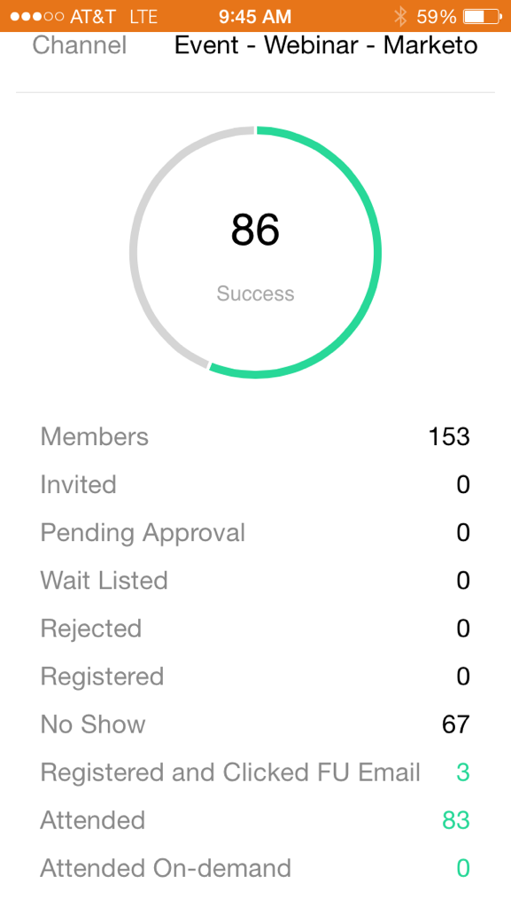

# Werken met gebeurteniskaarten {#understanding-event-cards}

Gebruik Marketo-momenten om uw gebeurtenisprogramma&#39;s weer te geven op uw telefoon of iPad.
`<iframe width="420" height="315" src="https://www.youtube-nocookie.com/embed/ecuf3hS3r3I" frameborder="0" allowfullscreen></iframe>` Wanneer u op een e-mailprogrammakaart tikt, kunt u:

* [Een gebeurtenis als favoriet maken](../../../../../product-docs/core-marketo-concepts/mobile-apps/marketo-moments/working-with-moments/creating-a-favorite.md)
* [Een gebeurtenis markeren zoals deze is uitgevoerd](../../../../../product-docs/core-marketo-concepts/mobile-apps/marketo-moments/working-with-moments/marking-it-done.md)
* [Een gebeurtenissenkaart delen](../../../../../product-docs/core-marketo-concepts/mobile-apps/marketo-moments/working-with-moments/sharing-a-moment.md)

Er zijn twee gebeurteniskaarten. De On-Deck-kaart, die een paar uur voor de gebeurtenis is verzonden, laat zien hoeveel personen zich hebben aangemeld. De kaart van Resultaten, die daarna wordt verzonden, toont hoeveel werkelijk bijgewoond.

Je bent goed!

>[!MORELIKETHIS]
>
>* [Marketo-momenten begrijpen](understanding-marketo-moments.md)
>* [E-mailprogrammakaarten](understanding-email-program-cards.md)
>* [Gebeurtenisprogramma&#39;s](../../../../../product-docs/demand-generation/events/understanding-events/understanding-event-programs.md)

>

