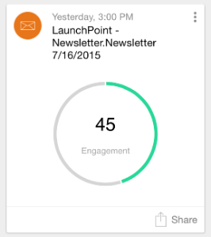

# Marketo-momenten begrijpen {#understanding-marketo-moments}

De kracht van Marketo ligt nu letterlijk in uw handen! Geef een voorbeeld van e-mailberichten weer en voer deze opnieuw in vanaf je telefoon of iPad.

>[!IMPORTANT]
>
>Op 2 oktober 2023 heeft Adobe de Marketo Moments App uit alle App Stores verwijderd. Als de app al op uw tablet/mobiel apparaat is geïnstalleerd, kunt u deze voorlopig blijven gebruiken. Zodra uw exemplaar van het Marketo Engage aan Adobe Identiteit voor authentificatie van Marketo wordt gemigreerd, zult u niet meer tot app kunnen toegang hebben. [Meer informatie](https://nation.marketo.com/t5/product-discussions/marketo-events-app-and-marketo-moments-app-end-of-life/m-p/340712/highlight/true#M193869){target="_blank"}.

>[!NOTE]
>
>_Mobiele apps openen_ toestemming is vereist. Neem contact op met uw Marketo-beheerder om [uw rol bijwerken](/help/marketo/product-docs/administration/users-and-roles/managing-user-roles-and-permissions.md).

## Streams {#streams}

Hier zijn de verschillende stromen in Moments.

>[!NOTE]
>
>**Definitie**
>
>* Momenten: alles wat net liep, of op het punt staat te lopen, gaat hier.
>* Favorieten: alles wat je een favoriet maakt, komt hier.
>* Later: alles wat later dan dit moment plaatsvindt, komt hier.
>* Gereed: Alles wat klaar is met uitvoeren of zoals u hebt gemarkeerd, gaat hier.

Oké, nu we dat uit de weg hebben, laten we even kijken op Marketo Moments aan de telefoon!

## Drie soorten kaarten {#three-kinds-of-cards}

Marketo Moments geeft je drie verschillende kaarten om de voortgang van je e-mail te volgen:

**On-Deck** - Dit e-mailbericht staat op het punt uit te gaan. Het is je laatste kans om het voor te vertonen, een voorbeeld te verzenden of zelfs te annuleren als je het nodig hebt.

**Hartslag** Deze e-mail wordt nu geleverd. En hier zijn ook stats. Ga door en deel het.

**Resultaten** - Zo deed de e-mail het. Nadat de e-mail volledig is uitgevoerd, geeft de Resultaten-kaart de betrokkenheidsscore en andere status weer.

## Momentstroom {#moments-stream}

Wanneer u de app voor de eerste keer opent of tikt **Momenten** in het menu worden eerst de relevante kaarten weergegeven. Elk initiatief bevat informatie over dat specifieke marketinginitiatief en de algemene prestaties ervan.

Tikken op de kaart opent een detailscherm.

>[!NOTE]
>
>Oranje kaarten worden bevestigd; grijze kaarten zijn tentatief.

Als u op de drie punten tikt, wordt een actiemenu voor de kaart geopend.

Geweldig! Nu, kunt u iets doen gebeuren door te tikken:

>[!NOTE]
>
>**Definitie**
>
>* Favoriet: Het is gemakkelijk om aandacht te besteden aan dingen die het meest geschikt en belangrijk zijn als je ze favorieten maakt.
>* Gereed: Klaar haalt het uit de weergave Marketo Moments (maar laat het in Marketo, veilig en geluid).
>* Delen: verzend een afbeelding om uw team te motiveren of te feliciteren.
>* Voorbeeld verzenden (alleen e-mail): gebruik deze optie om anderen te laten uitchecken hoe je e-mails eruit zien voordat je ze verzendt.
>* Voorbeeld van e-mail (alleen e-mails): het is altijd een goed idee om je e-mails vooraf te bekijken.

## Later momenten {#later-moments}

In het gedeelte Later worden toekomstige activiteiten weergegeven.

1. Tik eerst op het hamburgermenu.

   

1. Tikken **Later**.

   

   Zie een lijst met komende activiteiten.

   

## E-mailprogrammakaarten {#email-program-cards}

E-mailprogrammakaarten bevatten belangrijke zaken als planning, publiek, status en andere nuttige dingen, zelfs als je op de lunch bent.

## Gebeurteniskaarten {#event-cards}

Voor gebeurtenissen ziet u het totale aantal leden en hun status.

## Kaarten voor analyse {#analytics-cards}

Met Analytics Moment-kaarten kunt u zien hoe uw e-mails en gebeurtenissen de afgelopen zes maanden van maand tot maand zijn, bijvoorbeeld:

1. Opgehaalde leads
1. Nieuwe leads
1. Abonnementen opzeggen

## Smart Campagne Run Cards {#smart-campaign-run-cards}

De slimme campagnerekaarten vertegenwoordigen één enkele looppas van een campagne. Elke keer dat de slimme campagne wordt uitgevoerd, wordt een nieuwe kaart weergegeven. Tik om de gebruikte filters voor de slimme lijst, de campagnestroom en alle e-mails te zien die in de campagne worden gebruikt.

## Een handeling bevestigen of annuleren {#confirm-or-cancel-an-action}

U kunt elke stap van de manier bevestigen of annuleren. Tik gewoon op **Nooit denken**.

## Ondersteunde versies  {#supported-versions}

Marketo Moments ondersteunt de volgende versies van het besturingssysteem:

* Apple iOS 8.0 en hoger.
* Android versie 4.1 en hoger (in feite Jellybean en hoger).

Klaar om meer te leren?

>[!MORELIKETHIS]
>
>* [E-mailprogrammakaarten](/help/marketo/product-docs/core-marketo-concepts/mobile-apps/marketo-moments/understanding-moments/understanding-email-program-cards.md)
>* [Gebeurteniskaarten](/help/marketo/product-docs/core-marketo-concepts/mobile-apps/marketo-moments/understanding-moments/understanding-event-cards.md)
>* [Analysecards](/help/marketo/product-docs/core-marketo-concepts/mobile-apps/marketo-moments/understanding-moments/understanding-analytics-cards.md)
>* [Slimme camerakaarten](/help/marketo/product-docs/core-marketo-concepts/mobile-apps/marketo-moments/understanding-moments/understanding-smart-campaign-cards.md)
