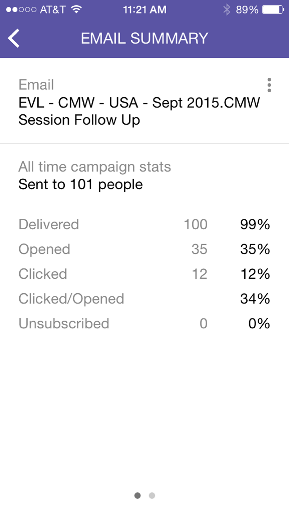

# Slimme camerakaarten {#understanding-smart-campaign-cards}

Gebruik Marketo-momenten om elke uitvoering van uw slimme campagnes vanaf uw smartphone of iPad weer te geven. De Marketo Moments Smart Campaign-kaart vertegenwoordigt één campagne. Elke keer dat de Smart Campaign wordt uitgevoerd, wordt er een nieuwe kaart weergegeven. De slimme kaarten van de Campagne worden duidelijk met een gloeilamp bij de hogere linkerzijde.

>[!IMPORTANT]
>
>Op 2 oktober 2023 heeft Adobe de Marketo Moments App uit alle App Stores verwijderd. Als de app al op uw tablet/mobiel apparaat is geïnstalleerd, kunt u deze voorlopig blijven gebruiken. Zodra uw exemplaar van het Marketo Engage aan Adobe Identiteit voor authentificatie van Marketo wordt gemigreerd, zult u niet meer tot app kunnen toegang hebben. [Meer informatie](https://nation.marketo.com/t5/product-discussions/marketo-events-app-and-marketo-moments-app-end-of-life/m-p/340712/highlight/true#M193869){target="_blank"}.

Voor toekomstige slimme campagnes die gepland zijn maar nog niet zijn uitgevoerd, geeft de Marketo Moments-kaart nog geen campagnestatistieken weer. Ze verschijnen in een toekomstige release.

## Slimme camerakaarten {#smart-campaign-cards}

1. Tik op de kaart om de detailkaart te openen.

   

1. Met de detailkaart hebt u toegang tot informatie over de filters Slimme lijst, Stroom en E-mailoverzicht.

1. Tikken **Slimme lijst**.

   

1. De filters die door de slimme lijst worden gebruikt worden hier getoond.

   

1. Tikken **Stroom**.

   

1. Nu, zult u de stroom van de Slimme Campagne zien. Deze campagne heeft slechts één stap in de goede richting, maar er kunnen meerdere stappen zijn.

   

1. Klikken **E-mailoverzicht**.

   

1. Nu, kunt u ontvankelijke reactie op elke e-mail, door aantal en percentage zien.

   

1. Zie die twee stippen onderaan? Ze geven aan dat er twee e-mails zijn verbonden met deze slimme campagne. Als u de resultaten voor de andere e-mail wilt bekijken, veegt u het scherm naar links. Hier volgen de resultaten van de tweede e-mail.

   

   >[!NOTE]
   >
   >De andere stip wordt nu gemarkeerd.

## E-mailvoorbeelden en voorvertoningen maken {#creating-email-samples-and-previews}

Het is een goed idee om een e-mail te bekijken voordat het naar buiten gaat. Of stuur een monster naar iemand anders om er een tweede oogje op te krijgen.

1. Tik op het actiemenu met drie punten op een e-mail.

   

1. Tikken [Voorbeeld verzenden](/help/marketo/product-docs/core-marketo-concepts/mobile-apps/marketo-moments/working-with-moments/sending-a-sample.md) of [E-mail voorvertonen](/help/marketo/product-docs/core-marketo-concepts/mobile-apps/marketo-moments/working-with-moments/previewing-an-email.md) (klik op deze koppelingen voor meer informatie).

   

## Een Smart Campaign-run bevestigen {#confirming-a-smart-campaign-run}

Kaarten voor niet-bevestigde slimme campagnes zijn grijs totdat u ze bevestigt. Dan worden ze oranje.

1. Tik op het driepuntactiemenu om een niet-bevestigde Smart Campagne-kaart te bevestigen.

   

1. Tikken **Bevestigen**.

   

1. Tikken **Bevestigen** om de taak te voltooien, of **Nooit denken** als je tweede gedachten hebt.

   

   >[!NOTE]
   >
   >Nu gaat je kaart naar oranje!

## Een Smart Campagne-uitvoering annuleren {#canceling-a-smart-campaign-run}

U kunt een bevestigde, geplande uitvoering van een slimme campagne annuleren.

1. Tik op het drie actiemenu voor stippen.

   

1. Tikken **Uitvoeren annuleren**.

   

1. Tikken **Uitvoeren annuleren**. Als u op het laatste moment besluit de uitvoering niet te annuleren, tikt u op **Nooit denken** en de slimme campagne wordt uitgevoerd zoals gepland.

   

## Het opnieuw instellen van een slimme campagne {#rescheduling-a-smart-campaign}

U kunt een bevestigde slimme campagne opnieuw plannen die nog niet is gestart.

1. Tik op het drie actiemenu voor stippen.

   

1. Tikken **Opnieuw plannen**.

   

1. Selecteer een datum op de kalender en tik op **Opnieuw plannen**.

   

   Stukje cake!

## Andere slimme-campagnehandelingen {#other-smart-campaign-actions}

Net als bij andere Marketo Moments-kaarten kunt u op de drie punten op elke Smart Campagne-kaart of op de detailkaart tikken:

* [Maak er een favoriet van](/help/marketo/product-docs/core-marketo-concepts/mobile-apps/marketo-moments/working-with-moments/creating-a-favorite.md)
* [Markeren als voltooid](/help/marketo/product-docs/core-marketo-concepts/mobile-apps/marketo-moments/working-with-moments/marking-it-done.md)
* [Delen](/help/marketo/product-docs/core-marketo-concepts/mobile-apps/marketo-moments/working-with-moments/sharing-a-moment.md)

>[!NOTE]
>
>U kunt ook op de knop **Delen** pictogram op een Smart Campagne-kaart die u wilt delen, en de **Gereed** en **Favoriet** pictogrammen op de detailkaart.

## Snel een Smart Campaign-kaart verwijderen {#quickly-delete-a-smart-campaign-card}

Als u een kaart hebt die u niet meer nodig hebt, bijvoorbeeld een kaart die u hebt gebruikt om te testen, kunt u deze verwijderen met een snelle veegbeweging naar links of rechts.
