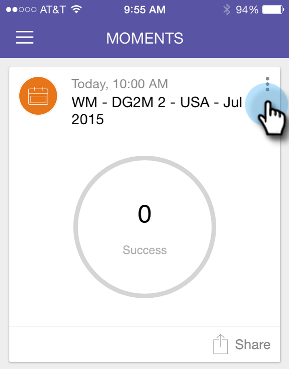

# Het markeren is voltooid {#marking-it-done}

Markeer een e-mailprogramma, gebeurtenis of analysekaart als [!UICONTROL Done] om deze uit uw stream te verwijderen. Er zijn twee manieren om het te doen.

>[!IMPORTANT]
>
>Op 2 oktober 2023 heeft Adobe de Marketo Moments App uit alle App Stores verwijderd. Als de app al op uw tablet/mobiel apparaat is geïnstalleerd, kunt u deze voorlopig blijven gebruiken. Zodra uw Marketo Engage-exemplaar is gemigreerd naar Adobe Identity voor verificatie van Marketo, hebt u geen toegang meer tot de app. [Meer info](https://nation.marketo.com/t5/product-discussions/marketo-events-app-and-marketo-moments-app-end-of-life/m-p/340712/highlight/true#M193869){target="_blank"}.

1. Tik op het actiemenu.

   

1. Tik op **[!UICONTROL Done]** .

   

1. Of veeg op de kaart.

   

   >[!NOTE]
   >
   >Als u een kaart als Gereed markeert, worden de e-mail, de gebeurtenis of de slimme campagne niet verwijderd. Het verplaatst het slechts van de stroom van Moments/Later in de Done stroom.
