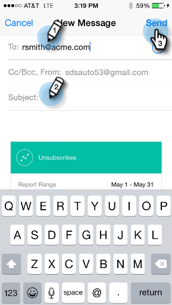

# Een moment delen {#sharing-a-moment}

Wilt u uw team bijwerken? U hebt twee opties om delen te selecteren.

>[!IMPORTANT]
>
>Op 2 oktober 2023 heeft Adobe de Marketo Moments App uit alle App Stores verwijderd. Als de app al op uw tablet/mobiel apparaat is geïnstalleerd, kunt u deze voorlopig blijven gebruiken. Zodra uw exemplaar van het Marketo Engage aan Adobe Identiteit voor authentificatie van Marketo wordt gemigreerd, zult u niet meer tot app kunnen toegang hebben. [Meer informatie](https://nation.marketo.com/t5/product-discussions/marketo-events-app-and-marketo-moments-app-end-of-life/m-p/340712/highlight/true#M193869){target="_blank"}.

1. Tik op de knop **Delen** op de kaart.

   

1. Tik op het kaartmenu en tik op **Delen** op het scherm Details.

   

   

1. Selecteer de manier waarop u wilt delen. Laten we met e-mail gaan.

   >[!NOTE]
   >
   >Het delen hangt van apps af die op uw telefoon worden geïnstalleerd. Als je geen Facebook hebt, zie je het niet in Moments.

   

1. Voer het adres van de ontvanger, een onderwerp en tik op **Verzenden**.

   

   Geweldig werk!
