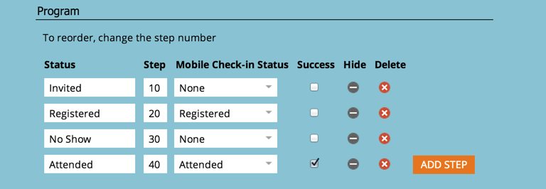

# Werken met het lidmaatschap van het programma {#understanding-program-membership}

>[!NOTE]
>
>Marketo is nu bezig met het standaardiseren van de taal voor alle abonnementen, zodat u in uw abonnement en de persoon/personen in onze documenten mogelijk leads/leads ziet. Deze termen betekenen hetzelfde, ze hebben geen invloed op de artikelinstructies. Er zijn nog enkele andere veranderingen. [Meer informatie](/help/marketo/product-docs/crm-sync/salesforce-sync/understanding-the-salesforce-sync.md){target="_blank"}.

>[!NOTE]
>
>**Definitie:** Een lid is een persoon die een status in een programma heeft.

## Hoe mensen lid worden van een programma {#how-people-become-members-of-a-program}

1. Een persoon vult een [formulier op een landingspagina](/help/marketo/getting-started/quick-wins/landing-page-with-a-form.md){target="_blank"} in het programma.

   1. De persoon krijgt automatisch de eerste status in de progressie.

1. U [invoer van leden in het programma](/help/marketo/product-docs/core-marketo-concepts/programs/working-with-programs/import-members-from-a-spreadsheet-into-a-program.md){target="_blank"} uit een CSV-bestand.

   1. De persoon krijgt automatisch de eerste status in de progressie.

1. U gebruikt de [status van programma wijzigen](/help/marketo/product-docs/core-marketo-concepts/smart-campaigns/program-flow-actions/change-program-status.md){target="_blank"} stap Stroom.
1. Een persoon registreert of woont een [webinar gesynchroniseerd met een gebeurtenisprogramma](/help/marketo/product-docs/demand-generation/events/understanding-events/event-partners.md){target="_blank"}.
1. Een persoon is [gemaakt met de Marketo iPad check-in toepassing](/help/marketo/product-docs/core-marketo-concepts/mobile-apps/event-check-in/check-people-into-your-event-from-your-tablet.md){target="_blank"}.
1. Een persoon wordt toegevoegd aan een SFDC-campagne, die [gesynchroniseerd met het programma](/help/marketo/product-docs/crm-sync/salesforce-sync/sfdc-sync-details/sfdc-sync-campaign-sync.md){target="_blank"}.

>[!NOTE]
>
>Voor een e-mailprogramma wordt alleen een persoon aan het lidmaatschap toegevoegd wanneer het e-mailbericht wordt verzonden.

## Programmastatussen {#program-statuses}

Programmastatus zijn de stappen die mensen doorlopen in een programma (bijv. Uitgenodigd, RSVP&#39;d, Bijgewoond, Geen show). Deze stappen worden gedefinieerd door de [kanaal](/help/marketo/product-docs/administration/tags/create-a-program-channel.md){target="_blank"}.

>[!NOTE]
>
>Een persoon kan zich niet achterwaarts naar een vroegere programmastatus verplaatsen. Voortgang van de status is slechts één manier.

## Status geslaagd {#success-statuses}

Het doel van een programma is een zinvolle interactie met de persoon of het vooruitzicht tot stand te brengen. Het succes wordt duidelijk wanneer een persoon de status bereikt die dat doel bereikt.

>[!NOTE]
>
>Voor een webinar is registratie geen zinvolle interactie als ze niet echt naar het webinar kijken. Bijwonen is in dit geval een succes.

## Overnameprogramma {#acquisition-program}

Wanneer een nieuwe naam het systeem als programmalid ingaat, plaatst Marketo automatisch dat programma als &quot;verwerving.&quot; Hiermee wordt krediet vastgesteld voor [First-Touch-kenmerk](/help/marketo/product-docs/reporting/revenue-cycle-analytics/revenue-tools/attribution/understanding-attribution.md){target="_blank"}.

>[!MORELIKETHIS]
>
>* [Tags gebruiken in een programma](/help/marketo/product-docs/core-marketo-concepts/programs/working-with-programs/understanding-tags/use-tags-in-a-program.md){target="_blank"}
>* [Een voortgangsrapport voor het programma maken](/help/marketo/product-docs/core-marketo-concepts/programs/program-performance-report/create-a-program-performance-report.md){target="_blank"}
