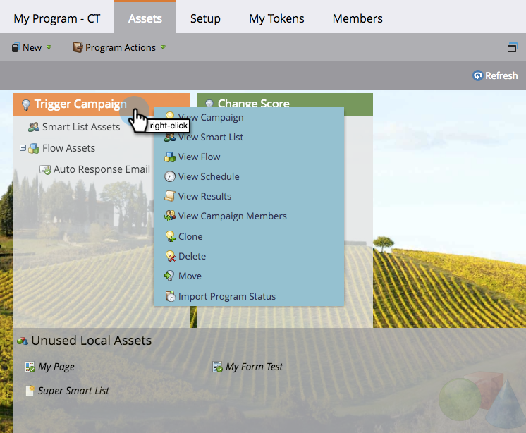

# Het tabblad Middelen gebruiken {#using-the-assets-tab}

Het canvas met elementen is een visuele weergave van uw standaard- of gebeurtenisprogramma. U kunt het gebruiken om lokale activa toe te voegen evenals met bestaande degenen in wisselwerking te staan.

## Elementen toevoegen {#adding-assets}

Klik op de knop **[!UICONTROL Assets]** in het gewenste programma. Kies hieronder een van de elementen en voeg deze toe aan uw programma.

## Uw programma beheren  {#manage-your-program}

Als er elementen in uw programma staan, worden deze hier weergegeven.

| Oranje | Trigger-campagne |
|---|---|
| Groen | Batchcampagne |

U kunt met de rechtermuisknop op de koptekst klikken als u met dat element wilt communiceren.

>[!TIP]
>
>Sleep en zet de aanwijzer neer om de kolommen met de elementen opnieuw te rangschikken.

Elementen die niet lokaal voor uw programma zijn, zien er als volgt uit:

Het tabblad Elementen is een geweldig kleine dashboard voor alles wat zich binnen het programma bevindt en waarnaar in het programma wordt verwezen.
