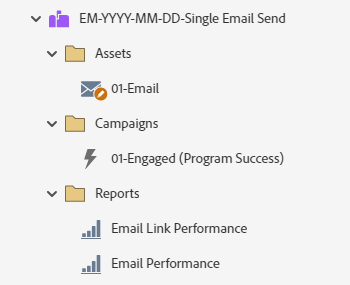

# EM-YYYY-MM-DD-Eén e-mail verzenden {#em-yyyy-mm-dd-single-email-send}

In dit voorbeeld wordt één e-mail verzonden via een Marketo Engage-e-mailprogramma. Het e-mailbericht kan een A/B-test bevatten of niet.

Voor verdere strategiehulp of hulp die een programma aanpassen, gelieve te contacteren het Team van de Rekening van Adobe of de [ Adobe Professional Services ](https://business.adobe.com/customers/consulting-services/main.html){target="_blank"} pagina te bezoeken.

## Kanaaloverzicht {#channel-summary}

<table style="table-layout:auto">
 <tbody>
  <tr>
   <th>Kanaal</th>
   <th>Lidmaatschapsstatus</th>
   <th>Analysegedrag</th>
   <th>Programmatype</th>
  </tr>
  <tr>
   <td>E-mail</td>
   <td>01-Lid
  02-Beheerd-Succes</td>
   <td>Inclusief</td>
   <td>E-mail</td>
  </tr>
 </tbody>
</table>

## Het programma bevat de volgende Assets {#program-contains-the-following-assets}

<table style="table-layout:auto">
 <tbody>
  <tr>
   <th>Type</th>
   <th>Sjabloonnaam</th>
   <th>Elementnaam</th>
  </tr>
  <tr>
   <td>E-mail</td>
   <td><a href="/help/marketo/product-docs/core-marketo-concepts/programs/program-library/quick-start-email-template.md" target="_blank">E-mailsjabloon snel starten</a></td>
   <td>01-E-mail-Dank u</td>
  </tr>
  <tr>
   <td>Lokaal rapport</td>
   <td> </td>
   <td>E-mailprestaties</td>
  </tr>
  <tr>
   <td>Lokaal rapport</td>
   <td> </td>
   <td>Prestaties van e-mailkoppelingen</td>
  </tr>
  <tr>
  <tr>
   <td>Slimme campagne</td>
   <td> </td>
   <td>01-Betrokken (succes van programma)</td>
  </tr>
  <tr>
   <td>Map</td>
   <td> </td>
   <td>Assets - Houdt alle creatieve middelen in huis
  (submappen voor e-mail- en bestemmingspagina's)  </td>
  </tr>
  <tr>
   <td>Map</td>
   <td> </td>
   <td>Campagnes - Houdt alle Slimme Campagnes</td>
  </tr>
  <tr>
   <td>Map</td>
   <td> </td>
   <td>Rapporten</td>
  </tr>
 </tbody>
</table>

## Mijn tokens inbegrepen {#my-tokens-included}

<table style="table-layout:auto">
 <tbody>
  <tr>
   <th>Type token</th>
   <th>Tokennaam</th>
   <th>Waarde</th>
  </tr>
  <tr>
   <td>Tekst</td>
   <td><code>{{my.Email-FromAddress}}</code></td>
   <td>PlaceholderFrom.email@mydomain.com</td>
  </tr>
  <tr>
   <td>Tekst</td>
   <td><code>{{my.Email-FromName}}</code></td>
   <td><code><--My From Name Here--></code></td>
  </tr>
  <tr>
   <td>Tekst</td>
   <td><code>{{my.Email-ReplyToAddress}}</code></td>
   <td>reply-to.email@mydomain.com</td>
  </tr>
 </tbody>
</table>

## Conflictregels {#conflict-rules}

* **de Markeringen van het Programma**
   * Creeer markeringen in dit abonnement - _Geadviseerde_
   * Negeren

* **het Bestaan malplaatje van de Pagina met de zelfde naam**
   * Originele sjabloon kopiëren
   * Het bestemmingsmalplaatje van het gebruik - _geadviseerde_

* **Beelden met de zelfde naam**
   * Beide bestanden behouden
   * Vervang punt in dit abonnement - _geadviseerde_

* **E-mailmalplaatjes met de zelfde naam**
   * Beide sjablonen behouden
   * Vervang bestaand malplaatje - _geadviseerde_

## Aanbevolen procedures {#best-practices}

* U kunt overwegen de sjablonen in uw geïmporteerde programma bij te werken om de sjablonen met branding te gebruiken of de nieuw geïmporteerde sjabloon bij te werken naar uw merk door deze toe te voegen in een fragment of door de juiste logo-/voettekstinformatie.

* U kunt overwegen de naamgevingsconventie van dit programmavoorbeeld bij te werken en deze uit te lijnen met uw naamgevingsconventie.

>[!NOTE]
>
>Herinner me om de Mijn Symbolische Waarden op het programmamalplaatje bij te werken en telkens als u het programma gebruikt, zoals nodig.

>[!TIP]
>
>Vergeet niet de campagne &quot;01-Betrokken&quot; te activeren om succes te volgen! Doe dit _alvorens_ uw vorm levend is en e-mails worden verzonden.
