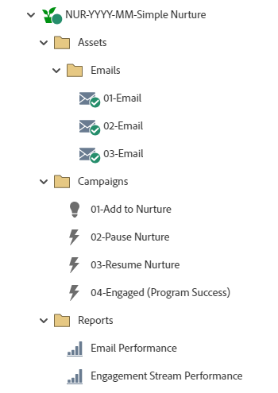

# NUR-YYYY-MM-Simple Nurture {#nur-yyyy-mm-simple-nurture}

Dit is een voorbeeld van eenvoudige programma&#39;s van de Verrichting, die het Programma van de Aansluiting van het Marketo Engage gebruiken, met inhoud aan druppel in tijd aan uw gegevensbestand terwijl het gebruiken van stromen om verslagen door reizen te begeleiden die op gedrag worden gebaseerd.

Voor verdere strategische hulp of hulp die een programma aanpast, gelieve het Team van de Rekening van de Adobe te contacteren of te bezoeken [Adobe Professional Services](https://business.adobe.com/customers/consulting-services/main.html){target="_blank"} pagina.

## Kanaaloverzicht {#channel-summary}

<table style="table-layout:auto"> 
 <tbody> 
  <tr> 
   <th>Kanaal</th> 
   <th>Lidmaatschapsstatus</th>
   <th>Analysegedrag</th>
   <th>Programmatype</th>
  </tr> 
  <tr> 
   <td>Verloop</td> 
   <td>01 - Lid 
 02 - Betrokken - Succes</td>
   <td>Inclusief</td>
   <td>Betrokkenheid</td>
  </tr>
 </tbody> 
</table>

## Het programma bevat de volgende elementen {#program-contains-the-following-assets}

<table style="table-layout:auto"> 
 <tbody> 
  <tr> 
   <th>Type</th> 
   <th>Sjabloonnaam</th>
   <th>Elementnaam</th>
  </tr> 
  <tr> 
   <td>E-mail</td> 
   <td><a href="/help/marketo/product-docs/core-marketo-concepts/programs/program-library/quick-start-email-template.md" target="_blank">E-mailsjabloon snel starten</a></td>
   <td>01 - E-mail</td>
  </tr>
   <tr> 
   <td>E-mail</td> 
   <td><a href="/help/marketo/product-docs/core-marketo-concepts/programs/program-library/quick-start-email-template.md" target="_blank">E-mailsjabloon snel starten</a></td>
   <td>02 - E-mail</td>
  </tr>
   <tr> 
   <td>E-mail</td> 
   <td><a href="/help/marketo/product-docs/core-marketo-concepts/programs/program-library/quick-start-email-template.md" target="_blank">E-mailsjabloon snel starten</a></td>
   <td>03 - E-mail</td>
  </tr>
  <tr> 
   <td>Lokaal rapport</td> 
   <td> </td>
   <td>E-mailprestaties</td>
  </tr>
  <tr> 
   <td>Lokaal rapport</td> 
   <td> </td>
   <td>Betrokkenheidsstreamprestaties</td>
  </tr>
  <tr>
  <tr> 
   <td>Slimme campagne</td> 
   <td> </td>
   <td>01 - Toevoegen aan cultuur</td>
  </tr>
  <tr> 
   <td>Slimme campagne</td> 
   <td> </td>
   <td>02 - Gepauzeerd</td>
  </tr>
  <tr> 
   <td>Slimme campagne</td> 
   <td> </td>
   <td>03 - Hervat de cultuur</td>
  </tr>
  <tr> 
   <td>Slimme campagne</td> 
   <td> </td>
   <td>04 - Betrokken (succes van programma)</td>
  </tr>
  <tr> 
   <td>Map</td> 
   <td> </td>
   <td>Activa - Houdt alle creatieve activa in huis
    (submappen voor e-mails)</td>
  </tr>
  <tr> 
   <td>Map</td> 
   <td> </td>
   <td>Campagnes - Houdt alle Slimme Campagnes</td>
  </tr>
  <tr> 
   <td>Map</td> 
   <td> </td>
   <td>Rapporten</td>
  </tr>
 </tbody> 
</table>

## Mijn tokens inbegrepen {#my-tokens-included}

<table style="table-layout:auto"> 
 <tbody> 
  <tr> 
   <th>Type token</th> 
   <th>Tokennaam</th>
   <th>Waarde</th>
  </tr>
  <tr> 
   <td>Tekst</td> 
   <td><code>{{my.Email-FromAddress}}</code></td>
   <td>PlaceholderFrom.email@mydomain.com</td>
  </tr>
  <tr> 
   <td>Tekst</td> 
   <td><code>{{my.Email-FromName}}</code></td>
   <td><code><--My From Name Here--></code></td>
  </tr>
  <tr> 
   <td>Tekst</td> 
   <td><code>{{my.Email-ReplyToAddress}}</code></td>
   <td>reply-to.email@mydomain.com</td>
  </tr>
 </tbody> 
</table>

## Conflictregels {#conflict-rules}

* **Programmatags**
   * Tags maken in dit abonnement - _Aanbevolen_
   * Negeren

* **Landingspagina-sjabloon met dezelfde naam**
   * Originele sjabloon kopiëren
   * Doelsjabloon gebruiken - _Aanbevolen_

* **Afbeeldingen met dezelfde naam**
   * Beide bestanden behouden
   * Item in dit abonnement vervangen - _Aanbevolen_

* **E-mailsjablonen met dezelfde naam**
   * Beide sjablonen behouden
   * Bestaande sjabloon vervangen - _Aanbevolen_

## Aanbevolen procedures {#best-practices}

* U kunt overwegen de sjablonen in uw geïmporteerde programma bij te werken om de sjablonen met branding te gebruiken of de nieuw geïmporteerde sjabloon bij te werken naar uw merk door deze toe te voegen in een fragment of door de juiste logo-/voettekstinformatie.

* U kunt overwegen de naamgevingsconventie van dit programmavoorbeeld bij te werken en deze uit te lijnen met uw naamgevingsconventie.

* Zorg ervoor dat u regels hebt om uw kinderopvoedkunde te pauzeren en te hervatten. Deze slimme campagnes moeten worden geactiveerd of gepland voordat het betrokkenheidsprogramma wordt geactiveerd.

>[!NOTE]
>
>Herinner me om de Mijn Symbolische Waarden op het programmamalplaatje bij te werken en telkens als u het programma gebruikt, zoals nodig.

>[!TIP]
>
>Vergeet niet de campagne &quot;04 - Betrokken (Programma Succes)&quot; te activeren om succes te volgen! Doe dit _voor_ je e-mailberichten worden verzonden.
