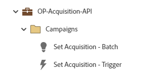

# OP-Acquisition-API {#op-acquisition-api}

Dit voorbeeldprogramma is voor operationele processen om de verwerving van verslagen van API bronnen te volgen die een Programma van het Standaard van het Marketo Engage gebruiken.

## Kanaaloverzicht {#channel-summary}

<table style="table-layout:auto"> 
 <tbody> 
  <tr> 
   <th>Kanaal</th> 
   <th>Lidmaatschapsstatus</th>
   <th>Analysegedrag</th>
   <th>Programmatype</th>
  </tr> 
  <tr> 
   <td>Operationeel</td> 
   <td>01-Lid</td>
   <td>Operationeel</td>
   <td>Standaard</td>
  </tr>
 </tbody> 
</table>

## Het programma bevat de volgende elementen {#program-contains-the-following-assets}

<table style="table-layout:auto"> 
 <tbody> 
  <tr> 
   <th>Type</th> 
   <th>Sjabloonnaam</th>
   <th>Elementnaam</th>
  </tr>
  <tr> 
   <td>Slimme campagne</td> 
   <td> </td>
   <td>Verwerving instellen - Batch</td>
  </tr>
  <tr> 
   <td>Slimme campagne</td> 
   <td> </td>
   <td>Verwerving instellen - trigger</td>
  </tr>
  <tr> 
   <td>Map</td> 
   <td> </td>
   <td>Campagnes (bevat alle slimme campagnes)</td>
  </tr>
 </tbody> 
</table>

## Conflictregels {#conflict-rules}

* **Programmatags**
   * Tags maken in dit abonnement - _Aanbevolen_
   * Negeren

* **Landingspagina-sjabloon met dezelfde naam**
   * Oorspronkelijke sjabloon kopiëren - _Aanbevolen_
   * Doelsjabloon gebruiken

* **Afbeeldingen met dezelfde naam**
   * Beide bestanden behouden - _Aanbevolen_
   * Item in dit abonnement vervangen

* **E-mailsjablonen met dezelfde naam**
   * Beide sjablonen behouden - _Aanbevolen_
   * Bestaande sjabloon vervangen

## Aanbevolen procedures {#best-practices}

* Voer eerst de batchcampagne uit als u uw gegevensbeheer wilt inhalen.

* Overweeg gelijkaardige programma&#39;s te gebruiken om zich aan beste praktijken over alle inputbronnen te verzekeren om uw CRM of Integratie van Gegevens te omvatten.

* Zorg ervoor dat binnen kanaalspecifieke marketinginitiatieven de acquisitie wordt vastgelegd wanneer dat nodig is.
