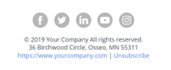

# E-mailsjabloon snel starten {#quick-start-email-template}

Sommige starterprogramma&#39;s in de Marketo Engage Reference Library bevatten een eenvoudige, gebruiksvriendelijke en aanpasbare e-mailsjabloon waarmee u snel e-mailberichten kunt maken in een aantal gevallen waarin u gebruikmaakt van marketing.

De e-maileditor van Marketo Engage is uitgerust met functies die u helpen de lay-out te wijzigen en de inhoud van uw e-mails te bewerken.

* **Modules**: Draggable/droppable inhoudsblokken die in het malplaatje worden gecodeerd. Ze kunnen opnieuw worden ingedeeld en gedupliceerd.

* **Elementen van de Tekst**: U kunt de redacteur gebruiken om exemplaar bij te werken, doopvontstijlen te veranderen, of verbindingen toe te voegen.

* **Elementen van het Beeld**: Gelijkaardig aan tekstelementen, kunnen de beelden uit worden geruild, worden verbonden met, en resized.

* **Variabelen**: Wanneer een module wordt geselecteerd, verschijnen de variabelen op de rechterkant van de redacteur. Deze kunnen worden gebruikt om attributen van de module aan te passen die niet gemakkelijk via beeld of tekstelementen editable zijn.

Voor verdere strategiehulp of hulp die een programma aanpassen, gelieve te contacteren het Team van de Rekening van Adobe of de [&#x200B; Adobe Professional Services &#x200B;](https://business.adobe.com/nl/customers/consulting-services/main.html){target="_blank"} pagina te bezoeken.

## Overzicht van modules {#modules-summary}

### Logomodule {#logo-module}

* Bevat een afbeeldingselement om het logo bij te werken
* Bevat variabelen die moeten worden beheerd:
   * Opvulling boven in module
   * Opvulling onder in module
   * Achtergrondkleur van module
   * Uitlijning van het logo
* 

### Afbeeldingsmodule {#image-module}

* Bevat een afbeeldingselement om de afbeelding bij te werken
* Bevat variabelen die moeten worden beheerd:
   * Opvulling boven in module
   * Opvulling onder in module
   * Achtergrondkleur van module
* 

### Kopmodule {#headline-module}

* Bevat een tekstelement om de kop bij te werken
* Bevat variabelen die moeten worden beheerd:
   * Opvulling boven in module
   * Opvulling onder in module
   * Achtergrondkleur van module
   * Fontgrootte van kopregel (kan ook worden bewerkt in de RTF-editor)
   * Fontkleur van kop (dit kan ook worden bewerkt in de RTF-editor)
   * Uitlijning van de koptekst (deze kan ook worden bewerkt in de RTF-editor)
* 

### Subheadlinemodule {#subheadline-module}

* Bevat een tekstelement om de subkop bij te werken
* Bevat variabelen die moeten worden beheerd:
   * Opvulling boven in module
   * Opvulling onder in module
   * Achtergrondkleur van module
   * Fontgrootte van subkop (kan ook worden bewerkt in de RTF-editor)
   * Fontkleur van subkop (dit kan ook worden bewerkt in de RTF-editor)
   * Uitlijning van de subkoptekst (deze kan ook worden bewerkt in de RTF-editor)
* 

### Vrije-tekstmodule {#free-text-module}

* Bevat een tekstelement om de tekst bij te werken
* Bevat variabelen die moeten worden beheerd:
   * Opvulling boven in module
   * Opvulling onder in module
   * Achtergrondkleur van module
   * Tekengrootte van tekst (kan ook worden bewerkt in de RTF-editor)
   * Tekstkleur van tekst (kan ook worden bewerkt in de RTF-editor)
   * Uitlijning van de tekst (deze kan ook worden bewerkt in de RTF-editor)
* 

### CTA Module {#cta-module}

* Bevat variabelen die moeten worden beheerd:
   * Opvulling boven in module
   * Opvulling onder in module
   * Achtergrondkleur van module
   * CTA-tekstkleur
   * CTA-achtergrondkleur
   * CTA-randkleur
   * De grensstraal van CTA (om de knopen rond te maken - **Nota**: deze eigenschap werkt niet in de e-mailcliënten van Microsoft Outlook)
   * CTA URL
   * CTA-tekst
   * CTA-uitlijning
* 

### Scheidingsmodule {#divider-module}

* Bevat variabelen die moeten worden beheerd:
   * Opvulling boven in module
   * Opvulling onder in module
   * Achtergrondkleur van module
   * Scheidingskleur
   * Hoogte van scheidingslijn (in pixels)
   * Breedte scheidingslijn (als %)
* 

### Voettekstmodule {#footer-module}

* Tekstelement dat kan worden gebruikt om sociale pictogrammen uit te wisselen of te koppelen
* Tekstelement voor bijwerken van de voetteksttaal
* Bevat variabelen die moeten worden beheerd:
   * Opvulling boven in module
   * Opvulling onder in module
   * Achtergrondkleur van module
   * Tekstkleur
   * Inhoud uitlijnen
* 
