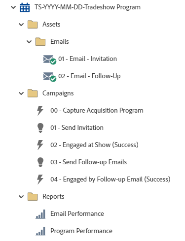

# TS-YYYY-MM-DD-Tradeshow-programma {#ts-yyyy-mm-dd-tradeshow-program}

Dit is een voorbeeld van een transactieprogramma met uitnodigingen en follow-up-e-mails die een gebeurtenisprogramma voor Marketo&#39;s Engage gebruiken.

Voor verdere strategische hulp of hulp die een programma aanpast, gelieve het Team van de Rekening van de Adobe te contacteren of te bezoeken [Adobe Professional Services](https://business.adobe.com/customers/consulting-services/main.html){target="_blank"} pagina.

## Kanaaloverzicht {#channel-summary}

<table style="table-layout:auto"> 
 <tbody> 
  <tr> 
   <th>Kanaal</th> 
   <th>Lidmaatschapsstatus</th>
   <th>Analysegedrag</th>
   <th>Programmatype</th>
  </tr> 
  <tr> 
   <td>Gebeurtenis</td> 
   <td>01-Uitgenodigd 
    02-Waitlijst
    03-Ingeschreven
    04-Bezochte Booth
    05-Gegroepeerd bij Show - Succes
    06-Gegroepeerd bij postshow - Succes</td>
   <td>Inclusief</td>
   <td>Gebeurtenis</td>
  </tr>
 </tbody> 
</table>

## Het programma bevat de volgende elementen {#program-contains-the-following-assets}

<table style="table-layout:auto"> 
 <tbody> 
  <tr> 
   <th>Type</th> 
   <th>Sjabloonnaam</th>
   <th>Elementnaam</th>
  </tr> 
  <tr> 
   <td>E-mail</td> 
   <td><a href="/help/marketo/product-docs/core-marketo-concepts/programs/program-library/quick-start-email-template.md" target="_blank">E-mailsjabloon snel starten</a></td>
   <td>01-E-mail-Dank u</td>
  </tr>
   <tr> 
   <td>E-mail</td> 
   <td><a href="/help/marketo/product-docs/core-marketo-concepts/programs/program-library/quick-start-email-template.md" target="_blank">E-mailsjabloon snel starten</a></td>
   <td>02a- E-mail - Uitnodiging</td>
  </tr>
  <tr>
  <tr> 
   <td>Lokaal rapport</td> 
   <td> </td>
   <td>E-mailprestaties</td>
  </tr>
  <tr> 
   <td>Lokaal rapport</td> 
   <td> </td>
   <td>Programmaprestaties</td>
  </tr>
  <tr> 
   <td>Slimme campagne</td> 
   <td> </td>
   <td>00 - Programma voor overname van vastleggingen</td>
  </tr>
  <tr> 
   <td>Slimme campagne</td> 
   <td> </td>
   <td>01 - Uitnodiging verzenden</td>
  </tr>
   <tr> 
   <td>Slimme campagne</td> 
   <td> </td>
   <td>02 - Verstuur vervolgberichten</td>
  </tr>
   <tr> 
   <td>Slimme campagne</td> 
   <td> </td>
   <td>03 - Betrokken door follow-up-e-mail (geslaagd)</td>
  </tr>
  <tr> 
   <td>Map</td> 
   <td> </td>
   <td>Activa - Houdt alle creatieve activa in huis 
 (submappen voor e-mail- en bestemmingspagina's)</td>
  </tr>
  <tr> 
   <td>Map</td> 
   <td> </td>
   <td>Campagnes - Houdt alle Slimme Campagnes</td>
  </tr>
  <tr> 
   <td>Map</td> 
   <td> </td>
   <td>Rapporten</td>
  </tr>
 </tbody> 
</table>

## Mijn tokens inbegrepen {#my-tokens-included}

<table style="table-layout:auto"> 
 <tbody> 
  <tr> 
   <th>Type token</th> 
   <th>Tokennaam</th>
   <th>Waarde</th>
  </tr>
  <tr> 
   <td>Kalenderbestand</td> 
   <td><code>{{my.AddToCalendar}}</code></td>
   <td>Dubbelklik voor details</td>
  </tr>
  <tr> 
   <td>Tekst</td> 
   <td><code>{{my.Email-FromAddress}}</code></td>
   <td>PlaceholderFrom.email@mydomain.com</td>
  </tr>
  <tr> 
   <td>Tekst</td> 
   <td><code>{{my.Email-FromName}}</code></td>
   <td><code><--My From Name Here--></code></td>
  </tr>
  <tr> 
   <td>Tekst</td> 
   <td><code>{{my.Email-ReplyToAddress}}</code></td>
   <td>reply-to.email@mydomain.com</td>
  </tr>
  <tr> 
   <td>Tekst</td> 
   <td><code>{{my.Event-Date}}</code></td>
   <td><code><--My Event Date--></code></td>
  </tr>
   <tr> 
   <td>RTF</td> 
   <td><code>{{my.Event-Booth#}}</code></td>
   <td><code><--My Booth Number--></code></td>
  </tr>
   <tr> 
   <td>Tekst</td> 
   <td><code>{{my.Event-City}}</code></td>
   <td><code><--My Event City Here--></code></td>
  </tr>
  <tr> 
   <td>Tekst</td> 
   <td><code>{{my.Event-Date}}</code></td>
   <td><code><--My Event Date--></code></td>
  </tr>
  <tr> 
   <td>Tekst</td> 
   <td><code>{{my.Event-Time}}</code></td>
   <td><code><--My Event Time + TimeZone--></code></td>
  </tr>
  <tr> 
   <td>Tekst</td> 
   <td><code>{{my.Event-Title}}</code></td>
   <td><code><--My Event Title Here--></code></td>
  </tr>
  <tr> 
   <td>Tekst</td> 
   <td><code>{{my.Event-Type}}</code></td>
   <td>Handelsversie</td>
  </tr>
 </tbody> 
</table>

## Conflictregels {#conflict-rules}

* **Programmatags**
   * Tags maken in dit abonnement - _Aanbevolen_
   * Negeren

* **Landingspagina-sjabloon met dezelfde naam**
   * Originele sjabloon kopiëren
   * Doelsjabloon gebruiken - _Aanbevolen_

* **Afbeeldingen met dezelfde naam**
   * Beide bestanden behouden
   * Item in dit abonnement vervangen - _Aanbevolen_

* **E-mailsjablonen met dezelfde naam**
   * Beide sjablonen behouden
   * Bestaande sjabloon vervangen - _Aanbevolen_

## Aanbevolen procedures {#best-practices}

* Na de invoer van het webinar programma, verplaats de vorm van lokaal activa aan globale activa die in de Studio van het Ontwerp worden gevestigd.
   * Door het aantal formulieren te verminderen en meer algemene middelen van de Design Studio te gebruiken, kunt u het ontwerp van uw programma en het beheer ervan meer schaalbaar maken. Het biedt ook flexibiliteit bij regelmatige compatibiliteitsupdates voor velden, de taal van de opt-in, enz.

* U kunt overwegen de sjablonen in uw geïmporteerde programma bij te werken om de sjablonen met branding te gebruiken of de nieuw geïmporteerde sjabloon bij te werken naar uw merk door deze toe te voegen in een fragment of door de juiste logo-/voettekstinformatie.

* U kunt overwegen de naamgevingsconventie van dit programmavoorbeeld bij te werken en deze uit te lijnen met uw naamgevingsconventie.

>[!NOTE]
>
>Herinner me om de Mijn Symbolische Waarden op het programmamalplaatje bij te werken en telkens als u het programma gebruikt, zoals nodig.

>[!TIP]
>
>Vergeet niet de campagne &quot;03 - Betrokken door follow-up-e-mail (Program Success)&quot; te activeren voor het bijhouden van succes! Doe dit _voor_ je e-mailberichten worden verzonden.

>[!IMPORTANT]
>
>Mijn tokens die naar een URL verwijzen, kunnen niet de URL http:// of https:// bevatten anders werkt de koppeling niet correct binnen het element.
