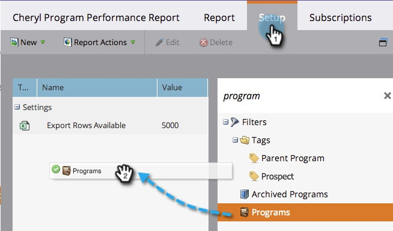

# Een programmarapport filteren op programma {#filter-a-program-report-by-program}

Focus uw [ rapport van de programmaprestaties ](/help/marketo/product-docs/core-marketo-concepts/programs/program-performance-report/create-a-program-performance-report.md){target="_blank"} op specifieke programma&#39;s om hun prestaties te vergelijken.

1. Ga naar **[!UICONTROL Marketing Activities]** (of **[!UICONTROL Analytics]** ).

   

1. Selecteer het prestatierapport voor uw programma.

   

1. Klik op de tab **[!UICONTROL Setup]** en sleep over **[!UICONTROL Programs]** .

   

1. Kies de mappen en specifieke programma&#39;s die u in uw rapport wilt opnemen.

   

   >[!TIP]
   >
   >Als u een map selecteert, bevat uw rapport alles wat de map bevat op het moment dat het rapport wordt uitgevoerd.

1. Dat is alles! Klik het **[!UICONTROL Report]** lusje om _enkel_ de geselecteerde programma&#39;s in uw rapport te zien.

   

>[!NOTE]
>
>[ filter een Rapport van het Programma door Markering ](/help/marketo/product-docs/core-marketo-concepts/programs/program-performance-report/filter-a-program-report-by-tag.md){target="_blank"}
