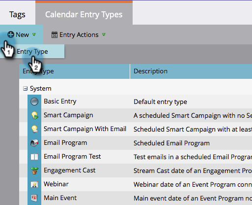

# Aangepaste invoertypen maken {#create-custom-entry-types}

U kunt de types van douaneingang tot stand brengen in uw Mening van het Programma te gebruiken. Hierdoor kun je alle agendapunten volgen die niet van invloed zijn op je programma.

1. Ga naar de **[!UICONTROL Admin]** sectie en klik op **[!UICONTROL Tags]**.

   

1. Klik op **[!UICONTROL Calendar Entry Type]**.

   

1. Klik op de knop **[!UICONTROL New]** vervolgkeuzelijst en selecteer **[!UICONTROL Entry Type]**.

   

1. Geef een naam op voor het bericht en selecteer een pictogram.

   

1. Selecteer een **[!UICONTROL Entry Color]**.

   

1. Klik op **[!UICONTROL Save]**.

   

Geweldig! Wanneer u nu een nieuwe ingang in uw planningsmening creeert, zal dit type een optie zijn.

>[!NOTE]
>
>U kunt tot 100 types van douaneingang tot stand brengen.
