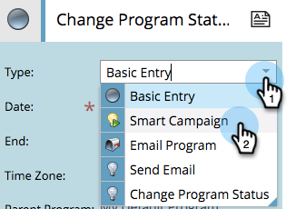

# Het creëren van een Partij Slimme Campagne in de Mening van het Programma {#creating-a-batch-smart-campaign-in-the-program-schedule-view}

U kunt nieuwe slimme campagnes tot stand brengen en bestaande [campagnes](rerun-a-smart-campaign-in-the-program-schedule-view.md) binnen uw programma van de mening van het programmaprogramma opnieuw uitvoeren.

>[!NOTE]
>
>In deze weergave kunnen alleen batchslimme campagnes worden gemaakt. Triggercampagnes worden niet ondersteund.

1. Selecteer de datum waarop de nieuwe slimme campagne moet worden uitgevoerd.

   

1. Kies een naam voor uw invoer, die uw nieuwe slimme campagne wordt. Druk op **Enter/Return** om de naam te bevestigen.

   

1. Klik op de vervolgkeuzelijst **Type** en kies **Slimme** **campagne**.

   

   >[!NOTE]
   >
   >U kunt ook een bestaande slimme campagne uitvoeren door deze in de keuzelijst te selecteren.

   

1. Kies uw regels voor [slimme campagnes](../../../../product-docs/core-marketo-concepts/smart-campaigns/creating-a-smart-campaign/create-a-new-smart-campaign.md) .

   

1. Deze slimme campagne wordt nu bevestigd in de overzichtsweergave en in de invoergegevens.

   

Hiermee maakt u een nieuwe slimme campagne in uw programma.