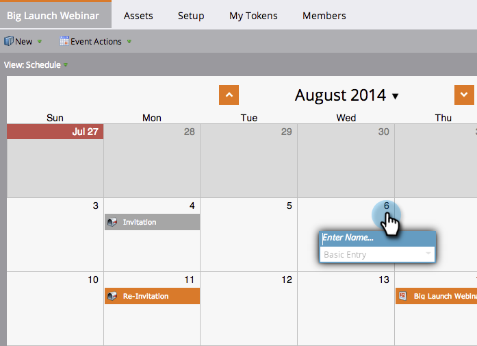

# Een nieuw e-mailprogramma maken in de overzichtsweergave {#creating-a-new-email-program-in-the-schedule-view}

U kunt een e-mailprogramma maken vanuit de programmaweergave van het programma. Zo gaat het.

1. Ga naar **Marketingactiviteiten**.

   

1. Selecteer uw programma.

   

1. Selecteer de datum waarop uw e-mailprogramma moet worden uitgevoerd.

   

1. Voer een naam in. Selecteren **E-mailprogramma**.

   

1. Klik in de invoergegevens op de koppeling naar uw nieuwe e-mailprogramma.

   

1. [Uw e-mailprogramma instellen](/help/marketo/product-docs/email-marketing/email-programs/creating-an-email-program/create-an-email-program.md) en klik op **Programma goedkeuren**.

   

   Naast het gedetailleerde dashboard, een voordeel aan het gebruiken van [e-mailprogramma](/help/marketo/product-docs/email-marketing/email-programs/creating-an-email-program/understanding-email-programs.md) in plaats van een slimme campagne is de mogelijkheid om een [A/B-test](/help/marketo/product-docs/email-marketing/email-programs/email-program-actions/email-test-a-b-test/add-an-a-b-test.md). Veel plezier!
