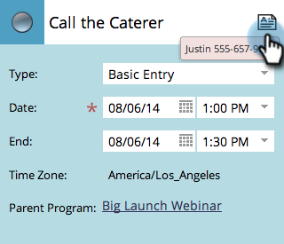

# Een vermelding maken in de programmaweergave {#creating-an-entry-in-the-program-schedule-view}

U kunt items maken vanuit de programmaweergave van het programma als aanvulling op een bestaand programma.

## Een basisitem maken {#create-a-basic-entry}

1. Ga naar **[!UICONTROL Marketing Activities]**.

   

1. Selecteer uw programma. Klik op de knop **[!UICONTROL View]** vervolgkeuzelijst. Selecteren **[!UICONTROL Schedule]**.

   

1. Klik op een dag waaraan u de invoer wilt toevoegen.

   

1. Geef de vermelding een naam. Druk **[!UICONTROL Enter]** om de naam te bevestigen.

   

1. Selecteer de begin- en einddatum/tijd van uw nieuwe invoer.

   

1. Klik op het beschrijvingspictogram om aanvullende informatie toe te voegen.

   

1. Voer uw beschrijving in en klik op **[!UICONTROL Save]**.

   

1. Houd de muisaanwijzer boven het beschrijvingspictogram om de invoerbeschrijving weer te geven.

   

## Invoertype wijzigen {#change-entry-type}

1. Selecteer een basisitem in het menu **[!UICONTROL Agenda]** weergeven.

   

1. Selecteer de **[!UICONTROL Type]** vervolgkeuzelijst. Kies een nieuw type item.

   >[!NOTE]
   >
   >To-do is a [aangepaste invoer](/help/marketo/product-docs/core-marketo-concepts/programs/program-schedule-view/create-custom-entry-types.md){target="_blank"}. U kunt een &#39;to-do&#39; en andere aangepaste items maken om niet-Marketo agendapunten bij te houden.

   

   Koel! U dient de wijzigingen direct te zien.

   

>[!NOTE]
>
> U kunt ook een [slimme campagne](/help/marketo/product-docs/core-marketo-concepts/programs/program-schedule-view/creating-a-batch-smart-campaign-in-the-program-schedule-view.md){target="_blank"} or [email program](/help/marketo/product-docs/core-marketo-concepts/programs/program-schedule-view/creating-a-new-email-program-in-the-schedule-view.md){target="_blank"} in de overzichtsweergave.
