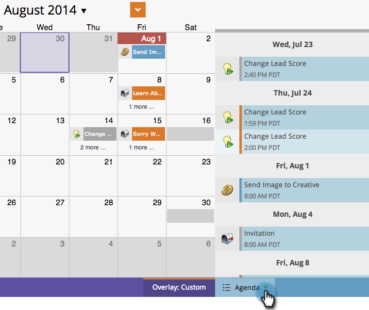

# Aangepaste overlays maken in de programmaweergave van het programma {#creating-custom-overlays-in-program-schedule-view}

U kunt aangepaste overlays maken om items weer te geven die relevant zijn voor uw behoeften.

1. Klik op de vervolgkeuzelijst **[!UICONTROL Agenda]** .

   

1. Selecteer **[!UICONTROL Overlays]**.

   

1. Selecteer de [!UICONTROL Entry Types] die u in de bedekking wilt weergeven.

   

1. U kunt ook filtreren door [ programmalabels ](/help/marketo/product-docs/core-marketo-concepts/programs/working-with-programs/use-tags-in-a-program.md){target="_blank"}.

   

   Geweldig. Uw bedekking geeft nu alleen de items weer die u hebt gedefinieerd.

   
