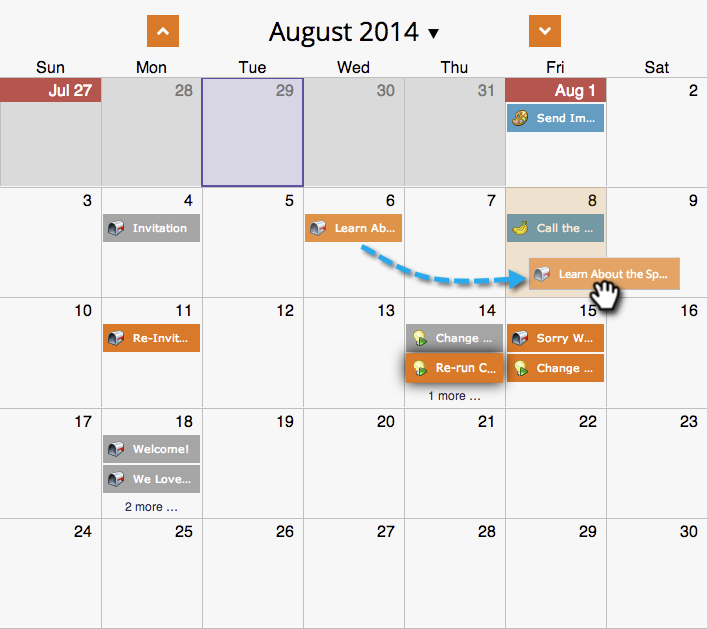

# Verplaatsen van ingangen in de Mening van het Programma {#moving-entries-in-the-program-schedule-view}

Als u items verplaatst in de overzichtsweergave, worden deze automatisch opnieuw gepland.

>[!NOTE]
>
>Een reeds uitgevoerde slimme campagne, betrokkenheidsprogramma, of het blazen van de post kan niet worden bewogen.

1. Selecteer uw ingang. Sleep en zet het neer op een andere datum.

   

1. Onze gegevens worden dan vrijgegeven, de datum wordt gewijzigd en het middel wordt opnieuw goedgekeurd. Hij is zo cool.

   

   Uw invoer wordt nu opnieuw gepland.

   
