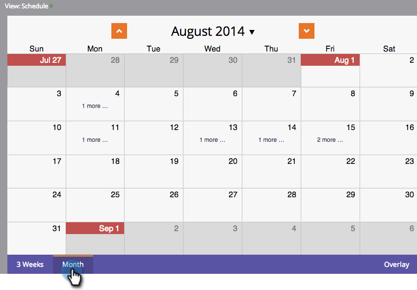

# Navigeren in de overzichtsweergave {#navigating-the-program-schedule-view}

Hier zijn de grondbeginselen om u te helpen de mening van het programmaprogramma navigeren.

## Zoek de overzichtsweergave {#find-the-schedule-view}

1. Ga naar **Marketingactiviteiten**.

   

1. Selecteer uw programma. Klik op de vervolgkeuzelijst **Weergave**. Selecteer **Schema**.

   

   Nu bekijkt u de planningsmening van uw programma.

   

>[!NOTE]
>
>De programmaweergave blijft ongewijzigd. Nadat u deze hebt ingesteld, worden alle programma&#39;s standaard ingesteld op de overzichtsweergave.

## Schakelen tussen items {#switching-between-entries}

1. Klik in de invoerdetails op de pijlen om naar de volgende geplande invoer te gaan.

   

   Mooi cool, hè?

   

## Contextmenu weergeven {#view-context-menu}

1. Klik met de rechtermuisknop op een programma om wijzigingen aan te brengen in Programma, Slimme lijst, Setup, Mijn tokens of Leden.

   

## Wijzigen tussen modi {#changing-between-modes}

1. Als u op **3 weken** of **Month** klikt, worden de zichtbare datums in de weergave gewijzigd.

   

## Volledige schermweergave {#full-screen-view}

1. U kunt op het schermpictogram in de rechterbovenhoek klikken om het programma in de modus Volledig scherm weer te geven.

   

Geweldig! Nu je weet hoe je je programma kunt bekijken, leren we de andere coole dingen die het kan doen.

>[!MORELIKETHIS]
>
>[Het creëren van een Ingang in de Mening van het Programma](/help/marketo/product-docs/core-marketo-concepts/programs/program-schedule-view/creating-an-entry-in-the-program-schedule-view.md)
