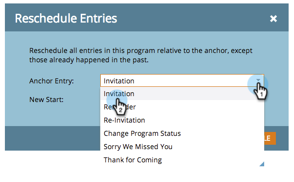
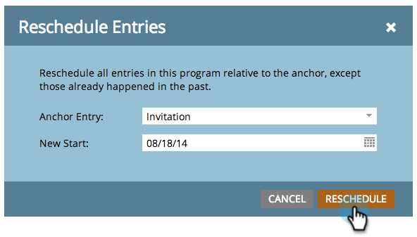

# Het opnieuw bepalen van een Hele Programma van de Mening van het Programma {#rescheduling-an-entire-program-from-the-schedule-view}

Wanneer u een programma of gebeurtenis met datums kloont, wilt u waarschijnlijk alle datums in één keer opnieuw plannen. Zo gaat het.

1. Selecteer het programma dat u opnieuw wilt plannen.

   

1. Selecteer de vervolgkeuzelijst Gebeurtenisactie. Kies **Opnieuw plannen**.

   

1. Selecteer een ankeritem. Op basis van deze verplaatsing worden alle andere items samen verplaatst.

   

1. Kies de nieuwe begindatum.

   

1. Klikken **Opnieuw plannen**.

   

1. Onze gegevens worden vervolgens door onze medewerkers verwijderd, opnieuw gepland en opnieuw goedgekeurd met de juiste datums.

   

>[!NOTE]
>
>Elementen die al zijn uitgevoerd, worden niet verplaatst.

Alles is nu opnieuw gepland. Pas zo nodig specifieke datums aan.

