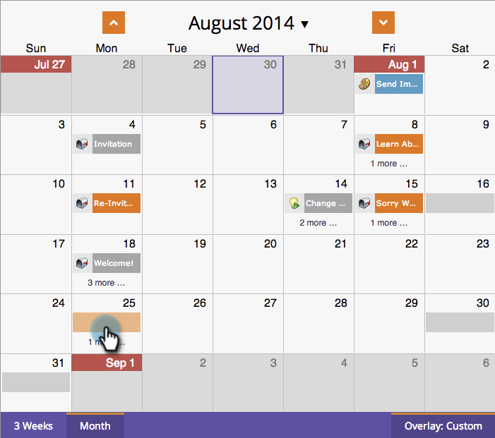

# Een algemene overlay gebruiken {#using-a-global-overlay}

Met de algemene overlay in de programmaweergave van het programma kunt u uw programma bekijken in relatie tot andere geplande middelen.

>[!PREREQUISITES]
>
>U moet beschikken over een [Licentie voor marketingkalender](/help/marketo/product-docs/core-marketo-concepts/marketing-calendar/understanding-the-calendar/issue-revoke-a-marketing-calendar-license.md) om deze functie te gebruiken.

## De algemene overlay gebruiken {#use-the-global-overlay}

1. Selecteer uw programma.

   

1. Selecteren **Bedekking** in de rechterbenedenhoek.

   

1. De effen blokken vertegenwoordigen de vermeldingen op die datum. Klik voor meer informatie.

   

   De invoerdetails voor overlayitems zijn alleen-lezen. Klik op het bovenliggende programma om wijzigingen aan te brengen.

   

## Een opgeslagen filter gebruiken als overlay {#use-a-saved-filter-as-an-overlay}

Als je [een filter opgeslagen in de Marketingkalender](/help/marketo/product-docs/core-marketo-concepts/marketing-calendar/working-with-the-calendar/saving-a-filter-definition-in-the-marketing-calendar.md), kunt u het als bedekking in de mening van het programmaprogramma gebruiken.

1. Klik op de knop **Bedekking** en selecteert u de filterdefinitie.

   

   Dat is makkelijk! Nu ziet u een bedekking die wordt gedefinieerd door het filter dat u hebt opgeslagen en geselecteerd.

   

   >[!MORELIKETHIS]
   >
   >[Aangepaste overlays maken in de programmaweergave van het programma](/help/marketo/product-docs/core-marketo-concepts/programs/program-schedule-view/creating-custom-overlays-in-program-schedule-view.md)
